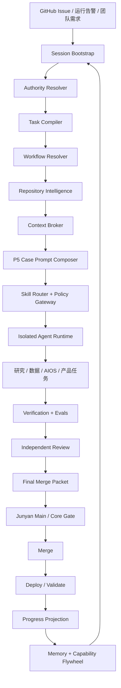

# AR AIOS 统一总蓝图 v3

**状态:** APPROVED STRATEGY / IMPLEMENTATION PROPOSED
**批准人:** Junyan
**批准日期:** 2026-08-12
**最终负责人:** Junyan
**项目主管:** Simon
**核心建设成员:** Reed、Jason、Better、Simon

> 本文是 AR AIOS 的唯一战略入口。它保留 v1 的完整生产系统设计与 v2 的六层工程、团队分工和学习路线，同时统一权威、权限、上下文、Prompt、跨模块长任务和 GitHub 协作语义。
>
> v1/v2 是完整保留的设计输入，但不再与本文并列成为现行权威。工程细节继续进入 `AI_OS_BUILD_GUIDE.md`；实施状态继续进入 `AI_OS_ENGINEERING_BACKLOG.md`；运行规则进入 `AGENTS.md`、Skills、schemas 和 config。

---

## 0. 已批准的五项决定

Junyan 于 2026-08-12 明确批准：

1. Junyan 保留最终总览、`main`、核心文件和高风险生产权，但不成为日常工作的前置瓶颈。
2. GitHub Issue、PR 和追加式事件是共享事实源；Progress Board 是自动只读投影。
3. Authority、Context 和 Prompt 使用 A/C/P 三套独立层级。
4. P5 是按 case 动态生成的表层角色 Prompt；它只改变工作方法，不改变权限和事实。
5. 全队共享 AIOS 存在 GitHub；本地只保存安全运行副本；模型通过统一 Harness 启动。

这五项为 `APPROVED`，机器记录见 `docs/llm/decisions/AIOS_V3_2026-08-12.decision.json`。本文其余实现路径与时间估算为 `PROPOSED`，仍需通过独立 Review、PR 和 Junyan 最终合并门。

---

## 1. 最终定义

AR AIOS 不是聊天机器人集合，也不是多模型路由器。它是围绕 AR 研究模型、软件系统和团队协作建立的智能生产操作系统：

> **Research OS 定义研究应该如何判断；AIOS 负责理解、规划、定位、执行、验证、协作和学习；Product OS 负责把能力稳定地交付给人。**

最终结构是：

> **一个 AI Harness 内核 + 六个工程能力层 + 一条 Evidence Chain + 一个人类学习飞轮。**

AIOS 同时承担三项任务：

1. 赋能模型：模型能够理解 AR 的规则、工作方式、文件关系、质量标准和团队风格。
2. 约束模型：模型在正确的文件、工具、网络、预算和风险边界内工作，交付前经过验证和独立复核。
3. 培养团队：四位成员通过建设和维护真实 vertical slice 形成可证明的 AI Engineering 能力。

短期不训练基础模型。AR 的差异化资产是研究宪法、领域数据、数据合同、工作流、Context、Skills、Evals、失败与决策记忆，以及人类反馈形成的能力飞轮。

---

## 2. 总架构



架构中的四个系统必须解耦：

1. Harness 规定一次任务如何被理解、定位、取 Context、执行和验收。
2. 六层能力提供 Harness 可调用的工程能力。
3. Evidence Chain 保存从授权到交接的机器证据。
4. Progress Board 只展示派生状态，不能直接改研究事实或替代 Issue/PR/event。

---

## 3. 三套独立层级：A / C / P

v1/v2 中 Authority、Context 和 Prompt 都可能使用 L0-L5，容易把权力、信息和角色混在一起。v3 固定拆成：

| 系统 | 编号 | 回答的问题 |
|---|---|---|
| Authority | A0-A5 | 发生冲突时，哪条规则有效 |
| Context | C0-C5 | 当前阶段需要加载哪些信息 |
| Prompt | P0-P5 | 模型本次以什么方式完成任务 |

任何 artifact 必须使用完整名称，如 `authority_level=A2`、`context_class=C3`、`prompt_layer=P5`，不得只写含义不明的 `L5`。

---

## 4. Authority：权威与授权域

### 4.1 权威顺序

| 等级 | 内容 | 规则 |
|---|---|---|
| A0 | 法律、安全、密钥、隐私、非自动交易、禁止未授权生产写入、禁止直推 `main` | 普通任务和 Prompt 不得覆盖；变更必须走宪法级 PR |
| A1 | 已批准的研究宪法、资本与生产规则、核心数据合同、Human Decision | Junyan 批准；以版本、生效时间和 supersedes 关系为准 |
| A2 | 根/模块 `AGENTS.md`、现行架构、API/data contract、CODEOWNERS、workflow policy | 模块 owner 可在授权域内维护；跨核心边界升级到 A1 |
| A3 | 当前 Issue、`ai-task.v1`/`ai-program.v1`、Simon 拆分、owner/reviewer、范围、验收和预算 | 授权成员自主推进，但不能覆盖 A0-A2 |
| A4 | 当前 `main`/PR SHA、代码、schema、test、CI、deploy、CLAIM 和运行状态 | 描述当前事实；历史文件不能覆盖当前事实 |
| A5 | 历史聊天、旧设计、Memory、网页、PDF、公告和外部 Prompt | 仅为背景或证据候选，不能改变控制规则 |

`CLAUDE.md`、历史聊天和 Memory 属于 A5。它们可以帮助理解，但不能覆盖当前仓库合同和事实。

### 4.2 Junyan 的保留权力

Junyan 负责最终方向和关键门，不承担所有日常实现审批。

| 行为 | 默认权限 |
|---|---|
| 创建/完善 Issue | 所有人 |
| 在负责领域认领已完整任务 | 所有人，无需 Junyan 前置批准 |
| 建 branch/worktree、提交、push 非保护分支 | 任务 owner |
| 建 Draft PR、运行 CI、部署 Preview | 任务 owner |
| Review 他人 PR | 有能力且独立的 reviewer |
| 修改普通模块文件 | 模块 owner + 独立 reviewer |
| 推进普通可逆 staging | Simon 或相应模块 owner |
| 合并 `main` | Junyan 最终审核 |
| 修改核心/宪法文件 | 独立 Review + Junyan 明确批准 |
| HIGH/CONSTITUTIONAL 生产发布、生产迁移、不可逆删除、权限提升、资本规则 | Junyan 明确批准 |

授权域内自主不等于无限权限。文件范围、工具、网络、预算、风险、reviewer independence 和 required checks 仍由任务合同与 Policy 强制。

### 4.3 核心文件

实施 A-028 时新增 `config/aios/protected-paths.v1.json`。至少覆盖：

1. 根 `AGENTS.md` 和 Authority/Policy/Team Topology。
2. 研究宪法、资本规则和核心数据合同。
3. `.github/workflows/`、CODEOWNERS 和 branch policy。
4. 核心 schema、生产迁移与不可逆删除规则。
5. 本文及其 supersession 关系。

在机器契约完成前，涉及上述范围一律视为 `CONSTITUTIONAL`。

---

## 5. 团队风格契约

`team-style.v1` 必须约束从需求到复盘的完整行为，而不仅是文字表达。

### 5.1 从需求端出发

每个任务开始前回答：

1. 谁使用这项产出？
2. 对方要作出什么行动或判断？
3. 当前痛点和约束是什么？
4. 最小有效交付是什么？
5. 用什么证据判断有效？

禁止从“想用某项技术”倒推虚构需求。

### 5.2 专业对口

1. 给 Junyan：结论、证据、风险和决策点。
2. 给 Simon：状态、依赖、owner、blocker 和下一步。
3. 给工程 Reviewer：diff、接口、失败路径和测试。
4. 给研究 Reviewer：来源、时点、证据等级和反证。
5. 给用户：可理解的结果、限制和操作方式。

### 5.3 事实纪律

1. 结论先行，事实、推断和建议分开。
2. 当前证据与历史证据分开。
3. `PARTIAL`、`STALE`、`UNKNOWN`、`DATA_BLOCKED` 不得写成 PASS。
4. 旧 CI 不得当作当前 head 证据。
5. 代码交付、Review、合并、部署和生产验证分别报告。
6. 跨文件修改必须列出 producer、schema、consumer、test 和 owner。
7. 不得为了迎合负责人隐藏反证。

### 5.4 复盘与系统优化

任务结束后回答：为什么发生、同类问题还在哪里、缺口属于代码/合同/测试/流程中的哪一类、应新增 regression/Skill/workflow/文档中的哪一种、能否复用。

Memory 只产生 `PROPOSED` 改进，不能自动修改宪法。风格类偏差通常产生 Warning；只有权限越界、证据不实、缺验收或不安全行为才阻断，避免风格契约变成新的官僚瓶颈。

### 5.5 统一状态表达

```text
STATE:
OWNER:
RESULT:
EVIDENCE:
BLOCKER:
DECISION_NEEDED:
NEXT:
```

Issue、Board 和群聊不得分别维护三套相互漂移的状态。

---

## 6. AI Harness：十二条建设子线

| 子线 | 主负责人 | 学习方向 | 搭建要求 | 首个验收任务 |
|---|---|---|---|---|
| H1 Session Bootstrap | Reed | Git、跨平台、可复现运行 | repo、branch、SHA、dirty、工具、权限、网络 | Mac/Windows 生成等价 `session-state.v1` |
| H2 Authority Resolver | Simon | policy-as-code、优先级 | Authority Graph、冲突、protected paths | 冲突进入 `AUTHORITY_CONFLICT` |
| H3 Task Compiler | Simon + Reed | 需求工程、JSON Schema | Issue → `ai-task.v1`；字段缺失 fail closed | 缺验收的请求进入 `SPEC_BLOCKED` |
| H4 Workflow Resolver | Simon | 状态机、依赖、TPM | task type、owner、reviewer、门、合并顺序 | 自动选择正确 workflow template |
| H5 Repository Intelligence | Reed | 静态分析、依赖图、lineage | 六张关系图、`change-map.v1` | 真实任务找到入口、消费者和测试 |
| H6 Context Broker | Better + Simon | RAG、检索、freshness、token | 分阶段 Pack、as-of、hash、充分性 Eval | `main` 改变后旧 Context 变 STALE |
| H7 P5 Prompt Composer | Better + Jason | Prompt、角色、structured output | 按 case/phase/risk 生成角色 Prompt | Reviewer 不继承执行者权限 |
| H8 Skill Registry/Router | Reed | 接口、能力注册、组合程序 | schema、权限、版本、owner、Eval | 原子 Skills 可组合并独立失败 |
| H9 Policy/Tool Gateway | Jason | IAM、威胁建模、最小权限 | 文件、工具、网络、secret、预算、风险门 | 越界路径/网络在执行前拒绝 |
| H10 Scheduler/Runtime | Reed | DAG、lease、幂等、恢复 | CLAIM、heartbeat、retry、cancel、checkpoint | 重叠文件任务不能同时写 |
| H11 Eval/Review Plane | Jason | golden set、mutation、judge 校准 | current-head eval、独立 Review、错误分类 | 删除治理门后测试因正确原因失败 |
| H12 Reconcile/Progress/Memory | Simon + Better | 事件溯源、投影、复盘 | Issue/PR/event → Board；Memory 提案 | Board 与 GitHub 不漂移 |

### 6.1 六层与 Harness 的关系

| 工程层 | Harness 子线 | 系统定位 |
|---|---|---|
| ① 编排与 Agent Runtime | H8、H10 | 神经传导和执行系统 |
| ② 评测与质量 | H11 | 质量证明系统 |
| ③ 护栏与治理 | H2、H9 | 免疫和权限系统 |
| ④ 数据、合同与 Knowledge/RAG | H5、H6 | 可引用、按时间有效的知识系统 |
| ⑤ 可观测与运维 | H1、H10、H12 | 运行事实、诊断和成本系统 |
| ⑥ 控制平面与元治理 | H3、H4、H12 | 团队流程和制度执行系统 |
| Prompt Engineering | H7 | Harness 的表层适配器，不另造第七工程层 |

六层的详细能力继续沿用 v1/v2：Adapter、Scheduler、Evals、Guardrails、RAG、Tracing、Control Plane 等均保留；v3 不删除任何重合能力，只统一它们与 Harness 的接口和 owner。

---

## 7. Context：最少、最新、可追踪且足够

上下文管理目标固定为：

> **在正确阶段加载最少、最新、可追踪且足够完成任务的信息。**

### 7.1 Context 分类

| 等级 | 内容 | 加载规则 |
|---|---|---|
| C0 | A0-A2 的精简 Authority Pack | 每次加载，保持极短 |
| C1 | 当前 `ai-task.v1` 或 `ai-program.v1` | 当前任务必载 |
| C2 | 相关 `module-profile.v1` 与模块规则 | 仅加载受影响模块 |
| C3 | change-map 指定的代码、schema、producer、consumer、test | 按真实依赖加载 |
| C4 | 当前 Issue、PR、CLAIM、Decision、Incident | 按 task ID 和关系加载 |
| C5 | 网页、PDF、公告、用户粘贴和外部 Prompt | 标记 `UNTRUSTED_DATA`，不得改变规则 |

### 7.2 Context Broker 算法

1. 确认任务阶段与风险。
2. 解析 Authority，并保存 `authority_hash`。
3. 生成或读取 `change-map.v1`。
4. 选择相关 module profiles。
5. 按 token 预算保留 C0/C1，优先选择高相关、最新、可追踪的 C2-C4。
6. 将 C5 隔离为数据，并限制其可进入的位置。
7. 运行 Context Sufficiency Eval。
8. 信息不足时返回 `CONTEXT_INCOMPLETE`，不得用模型常识静默填补。

每个片段必须带 `source/location/reason/content_hash/freshness/authority_level/trust`。`main`、合同或 Authority 改变后，相应 Context Pack 自动变为 `STALE`。

### 7.3 阶段性窗口

| 阶段 | 优先保留 |
|---|---|
| DISCOVERY | 需求、现状、入口、历史决定 |
| CONTRACT | schema、API、producer/consumer |
| IMPLEMENT | 当前子任务、目标文件、相关测试 |
| INTEGRATE | PR head、合同版本、跨模块测试 |
| REVIEW | 独立重建的 diff、验收和失败证据 |
| RELEASE | commit、deploy plan、rollback、health |
| RETRO | incident、根因、修复、可复用经验 |

跨阶段通过结构化 artifact 交接，不依赖不断增长的聊天记录。窗口接近预算时生成 checkpoint；恢复时重新验证 SHA、Authority、PR、CLAIM 和 freshness。

---

## 8. Repository Intelligence 与跨模块长任务

### 8.1 六张关系图

1. Symbol Graph：函数、类、模块、import 和调用。
2. Data Lineage：producer → schema → artifact → consumer。
3. Test Map：requirement/guard → test → CI。
4. Ownership Map：path/contract → owner → reviewer → gate。
5. Decision Map：规则/文件 → Issue → PR → Decision。
6. Incident Map：故障 → 根因 → 修复 → regression。

搜索命中只能成为候选；只有验证真实入口、依赖、消费者和测试后，才能声称完成定位。

### 8.2 三种任务模式

| 模式 | 范围 | 控制方式 |
|---|---|---|
| FAST | 只读、简单文档、小范围诊断 | 精简 Task 和 Evidence；不产生副作用 |
| STANDARD | 单模块、一个可独立验收 PR | 一个 Issue、一个 branch/worktree、一个 PR |
| PROGRAM | 跨 research/data/aios/product、多个 PR 或多个发布阶段 | Parent Issue + 子任务 DAG + 分阶段 Context |

### 8.3 Program Mode

长任务新增 `ai-program.v1`，至少保存：总目标、非目标、模块、子任务 DAG、共享合同、owner/reviewer、PR 与合并顺序、集成测试、发布/回滚和 Program 完成标准。

```text
PARENT ISSUE
→ DISCOVERY / ARCHITECTURE
→ CONTRACT / SCHEMA
→ PRODUCER + CONSUMER TASKS
→ INTEGRATION
→ RELEASE CANDIDATE
→ DEPLOY VALIDATION
→ RETRO / MEMORY
```

每个主要模块实施 `module-profile.v1`：owner/reviewer、入口、上下游、schema/artifacts、required tests、默认风险、Skills、Context 预算、发布方式和历史事故。

---

## 9. Prompt：P5 Case-Adaptive Execution Prompt

原 v1/v2 的“L5 外部 Prompt”现在归入 C5。模型表层的动态角色层使用 P5。

| 层 | 内容 |
|---|---|
| P0 | 模型平台安全和系统边界 |
| P1 | AR 宪法与共享安全规则 |
| P2 | 当前任务合同 |
| P3 | 模块规则、Skills 和 Context references |
| P4 | 当前阶段方法、工具计划和输出 schema |
| P5 | 根据具体 case 生成的动态角色 Prompt |

P5 只能改变“如何做”，不能改变“允许做什么”。

### 9.1 P5 标准结构

```text
ROLE:
CASE_TYPE:
PHASE:
AUDIENCE:
MISSION:
SUCCESS_CRITERIA:
MUST_USE_CONTEXT:
METHOD:
ALLOWED_TOOLS:
FORBIDDEN_ACTIONS:
QUALITY_RUBRIC:
STOP_AND_ESCALATE_IF:
OUTPUT_SCHEMA:
```

生成规则：

```text
P5 = role(case_type) + phase + module + risk + deliverable contract
```

### 9.2 初始角色模板

| Case | P5 角色 | 特殊规则 |
|---|---|---|
| 研究证据整合 | Evidence Analyst | 来源、时点、事实/推断/反证分离 |
| 普通代码建设 | Domain Implementer | 先定位、按范围施工、失败测试 |
| PR Review | Independent Adversarial Reviewer | 重建独立 Context；findings first；默认不改代码 |
| 故障诊断 | Incident Diagnostician | 先确定根因；不把修复授权视为默认存在 |
| 数据合同/RAG | Data & Retrieval Engineer | citation、as-of、missing/conflict 显式 |
| 跨模块项目 | Systems Integrator | 合同先行、DAG、集成门、合并顺序 |
| 部署验收 | Release Verifier | 代码交付与生产状态分离；检查回滚/health |
| 工作流优化 | Process Architect | 从需求和证据出发，提出可验证的系统改进 |

模板存入 GitHub。每次具体 Prompt 通常不提交，只在 `ai-run.v1` 保存 `profile/version/hash`；敏感内容只保存 hash。

---

## 10. Skill Mesh

AIOS 采用一个轻量 `ar-work-harness` 和多个可独立评测的原子 Skills：

```text
ar-start-session
→ ar-resolve-authority
→ ar-compile-task
→ ar-resolve-workflow
→ ar-locate-change
→ ar-build-context
→ ar-compose-case-prompt
→ ar-analyze-impact
→ domain skill
→ ar-verify-delivery
→ ar-adversarial-review
→ ar-handoff-task
→ ar-distill-memory
```

每个 Skill 必须声明 trigger、input/output schema、tools、scope、network、risk、owner、failure modes 和 Eval。详细知识放 references，脆弱操作放确定性 scripts。Skill 之间传结构化 artifact，不传不可验证的自由摘要。

当前已有六个领域 Skills，应复用：

- `ar-aios-engineering`
- `ar-product-engineering`
- `ar-research-framework`
- `ar-adversarial-review`
- `ar-task-delivery`
- `ar-workspace-sync`

新增 Skills 按真实 vertical slice 分批实施。没有 Eval 的空 Skill 不进入默认链。

---

## 11. 团队工作流与 Progress Board

### 11.1 事实源分工

| 位置 | 保存内容 | 事实源 |
|---|---|---|
| GitHub Issue | 需求、范围、验收、owner、依赖、blocker、人工决定 | 是 |
| branch/worktree | 当前实施工作 | 临时事实 |
| Pull Request | diff、测试、Review、风险和 deploy plan | 是 |
| `ai-progress.v2` | CLAIM、heartbeat、状态转换、evidence refs | 是，追加式 |
| Progress Board | Issue/PR/event/CI/deploy 的统一展示 | 否，只读投影 |
| GitHub Actions artifacts | run、verify、review、eval | 证据源 |
| 本地 `.ai-workspace/` | Context 缓存、索引、session、临时报告 | 否 |
| 群聊 | 通知、协调和摘要 | 否 |

Board 按钮如果存在，只能追加合法事件，不能直接覆盖派生状态。成员不得在 Issue、Board 和群聊重复维护三套状态。

### 11.2 稳定流程

1. **INTAKE:** 任何正式工作建立 Issue；Simon triage、分配 owner/reviewer/依赖；Task Compiler 生成 `ai-task.v1`。
2. **CLAIM:** owner 通过 CLI/Issue command/Board event 产生 CLAIM；登记 branch/worktree；Board 自动投影。
3. **IMPLEMENT:** 尽早建立 Draft PR；按 change-map、Context 和 file scope 施工。
4. **VERIFY:** owner 运行 acceptance、失败用例、schema、secret、权限和 current-head 检查。
5. **REVIEW:** Draft → Ready；独立 reviewer 生成 `ai-review.v1`；新 commit 使旧 Review/CI/Context/approval 变 STALE。
6. **FINAL GATE:** Harness 生成 Final Merge Packet；Junyan 做 `APPROVE/REVISE/REJECT/DEFER/RETIRE`。
7. **MERGE/DEPLOY:** `DELIVERED → REVIEWED → APPROVED → MERGED → DEPLOYED → PRODUCTION_VALIDATED → DONE` 分开记录。
8. **CLOSE:** 更新 Issue、释放 CLAIM、同步 Board、生成 handoff、Memory proposal 和 capability evidence；incident/高风险/跨模块任务执行复盘。

文档任务可在 MERGED 后通过明确的 no-runtime exemption 进入 DONE。产品和 runtime 任务必须完成部署与 health/acceptance 验证。Preview 可自动；普通可逆 staging 可由 Simon/owner 推进；HIGH/CONSTITUTIONAL production 仍需 Junyan。

### 11.3 Final Merge Packet

Junyan 日常只需看到：

1. 需求和实际结果。
2. 变更范围、核心文件命中和 cross-module blast radius。
3. current-head 正/负向验证。
4. 独立 reviewer 结论和未解决 findings。
5. 风险、残余问题、deploy/rollback。
6. 请求的明确决定。

---

## 12. 团队分工与学习系统

### 12.1 四条 T 型路径

| 成员 | 主路径 | 主工程责任 | 横向复核 |
|---|---|---|---|
| Simon | Technical AI PM / Workflow & Context Architect | H2-H4、Program Mode、控制面、任务/依赖/合并顺序 | 所有层的范围、交接和流程一致性 |
| Reed | Agent Platform / Runtime / LLMOps | H1、H5、H8、H10、运行后端 | Jason 的安全门；Better 的 RAG 接口 |
| Jason | AI Quality / Safety / Reliability | H7/H9/H11、Evals、Guardrails、runtime security | Reed 的状态机和执行声明 |
| Better | Knowledge / Context / Prompt / AI Product | H6/H7/H12、RAG、Context、Board、反馈体验 | Context 可用性和产品呈现 |
| Junyan | AI Systems Product Owner / Domain Governor | A1、研究质量标准、优先级、main/core/final gate | 高风险、跨域和方法论变更 |

Claude/Codex/Kimi 可以实施、解释、测试和 Review，但不能成为任何工程层的人类 owner，也不能替成员完成理解和长期维护。

### 12.2 共同技能底座

所有四位成员必须掌握：

1. GitHub Issue/branch/worktree/PR/Review/CI/CD。
2. Python、TypeScript、API、SQL、JSON Schema。
3. LLM structured output、tool use、token 和错误模式。
4. Prompt 与 Context Engineering、RAG、citation、freshness。
5. Agent 状态机、DAG、幂等、retry、timeout、checkpoint。
6. sandbox、最小权限、prompt injection、secret 和 network policy。
7. golden dataset、回归、mutation、false pass/false reject。
8. logs、trace、cost、failure class、SLO 和 incident。
9. AR 研究合同、证据等级、时点和非自动交易边界。

### 12.3 每项学习任务的固定验收

每个学习任务必须同时包含：一个明确概念、一个真实工程制品、一个正常用例、一个失败/攻击用例、一次本人讲解、一次跨成员 Review、一份残余风险、一次复盘或模拟事故。

只提交学习笔记不能计入 Human Ownership Rate。

| 等级 | 达标定义 |
|---|---|
| L0 Observer | 能运行系统并解释输入输出 |
| L1 Contributor | 能修改受限组件并补测试 |
| L2 Owner | 能设计接口、实现失败路径、处理 Review 和常见事故 |
| L3 Maintainer | 能复核他人、守 SLO、处理迁移与演进架构 |

2-3 周是受指导 demo；8-12 周是 bounded v0；lease、judge 校准、as-of、容器/云和宪法迁移通常需要 6 个月以上。晋级依据是制品、测试、事故处理和讲解能力，不按时间自动发生。

---

## 13. Evidence、Evals 与安全

非简单任务按风险产生：

1. `session-state.v1`
2. `authority-pack.v1`
3. `ai-task.v1` 或 `ai-program.v1`
4. `workflow-plan.v1`
5. `change-map.v1`
6. `context-pack.v1`
7. `prompt-plan.v1`
8. `ai-run.v1`
9. `ai-artifact.v1`
10. `ai-verify.v1`
11. `ai-review.v1`
12. `ai-decision.v1`
13. `handoff.v1`
14. `ai-memory.v1`

三道核心门：合同门、护栏门、评测门。核心/CONSTITUTIONAL 任务再经过 Junyan Final Gate。

审批与验证绑定 `task_id/run_id/head SHA/base SHA/authority hash/context hash/prompt version/policy version/reviewer identity`。关键项改变后旧证据变 STALE。

LLM-as-judge 只作为辅助证据。高风险门必须有正向、负向、mutation 和 current-head CI。模型不得成为自己的唯一正式 reviewer。

风险等级：

| 等级 | 示例 | 自动化边界 |
|---|---|---|
| LOW | 文档、离线分析 | 可按任务合同自动执行和验证 |
| MEDIUM | 普通代码、前端 | PR + 独立 Review；无需 Junyan 过程审批 |
| HIGH | workflow、权限、生产数据和敏感发布 | 双重 Review + Junyan 关键门 |
| CONSTITUTIONAL | 研究/资本规则、核心权限、本文和根规则 | 只能提案；Junyan 明确批准并最终合并 |

---

## 14. GitHub、本地与模型运行时

### 14.1 GitHub：唯一共享事实源

目标结构：

```text
docs/llm/
  AR_AIOS_MASTER_BLUEPRINT_v3.md
  AI_OS_BUILD_GUIDE.md
  AI_OS_ENGINEERING_BACKLOG.md
  archive/
    AR_AIOS_COMPLETE_DESIGN_v1.md
    AR_AIOS_TOTAL_BLUEPRINT_v2.md

config/aios/
  authority-graph.v1.json
  protected-paths.v1.json
  team-topology.v1.json
  team-style.v1.json
  workflow-templates.v1.json
  module-profiles.v1.json
  prompt-registry.v1.json
  skill-registry.v1.json
  model-registry.v1.json
  tool-registry.v1.json

scripts/llm/ai_os/
  bootstrap.py
  authority.py
  workflow.py
  repo_mapper.py
  context_broker.py
  prompt_composer.py
  skill_router.py
  policy.py
  scheduler.py
  executor.py
  verifier.py
  reviewer.py
  reconciler.py
  memory.py

.agents/skills/
  ar-work-harness/
  ar-start-session/
  ar-resolve-authority/
  ar-resolve-workflow/
  ar-locate-change/
  ar-build-context/
  ar-compose-case-prompt/
  ar-verify-delivery/
  ar-handoff-task/
  ...domain skills
```

这是目标结构，不代表尚未存在的模块已经落地。

### 14.2 本地：安全运行副本

每台机器使用 git clone/worktree 获取相同版本；`.ai-workspace/` 保存 session、context cache、repo index、runs、checkpoints 和 local reports。API keys、tokens、密钥、大型索引、缓存、runtime logs 和未批准输出只保存在本地或 approved secret/object storage。

不得用 Dropbox、iCloud 等文件同步服务同步 Git worktree。团队同步固定为：

```text
fetch → branch/worktree → test → PR → review → Junyan final merge
```

### 14.3 模型如何获得 AIOS

目标入口：

```text
aios start --issue <id>
```

入口负责 doctor、Authority、Task/Program、Workflow、change-map、Context、Skills、P5 Prompt、Policy、模型启动和 Evidence。Codex、Claude、Kimi 只实现 adapter，不分别复制整套 AR 宪法。

模型专属入口只保留薄引导：读取根 `AGENTS.md`，执行 Harness bootstrap，消费生成的 Authority/Task/Context/Skill/Prompt artifacts。

---

## 15. 路线图

### Phase 0：事实源与治理统一

1. 合并本文，并保留 v1/v2 archive。
2. 对齐 `AGENTS.md`、Team Charter、Build Guide 和 Backlog。
3. 登记 A-028 至 A-036。
4. 实施 protected paths、branch protection、stale approval、CODEOWNERS 和 governance mutation。
5. 清理重复 PR、过期 CLAIM 和并行事实源。

### Phase 1：Harness 决策链

Authority Resolver、Task Compiler 扩展、Workflow Resolver、Team Style、P5 Prompt Registry。

退出标准：一个 Issue 可生成 Authority、Task、Workflow、Case Prompt，冲突和缺项 fail closed。

### Phase 2：Context 与跨模块能力

Repository Intelligence、Module Profiles、Context Broker、`ai-program.v1`、Skill Registry。

退出标准：一个跨模块需求可拆为子任务 DAG，并为每阶段生成最小充分 Context。

### Phase 3：可信单 Agent 与团队闭环

Policy Gateway、Runtime/Scheduler、Evals、Progress projection、Reconciler、Memory/Capability。

退出标准：一个真实任务从 Issue 稳定运行到 PR、Review、Junyan final gate、部署验证和复盘。

### Phase 4：多 Agent 与能力飞轮

仅在单 Agent 的 Trusted Delivery Rate、Time to Trust 和恢复能力稳定后，建设多 Agent、持续 Evals、Shadow/Canary、容器/云和动态路由。

---

## 16. 北极星指标

1. **Trusted Delivery Rate:** 有 current-head task、verify、independent review 和 decision 证据的可信交付比例。
2. **Time to Trust:** 从需求进入到独立 reviewer 可以基于完整证据做决定的时间，不是模型第一次输出时间。
3. **Human Ownership Rate:** 成员能解释、复现、修复和复核自己负责层的交付比例。

辅助指标：Authority/文件/依赖召回率、Context precision/stale rate、mutation kill rate、false pass/reject、RAG citation accuracy、人工返工、cost per trusted delivery、incident MTTR。

第一阶段只采集基线，不预设未经验证的漂亮目标。

---

## 17. 明确不做

1. 不训练基础模型。
2. 单 Agent 不可靠时不建设 Agent swarm。
3. 不先导入全部文档做大而全 RAG。
4. 不让 LLM-as-judge 成为唯一质量门。
5. 不让 AI 自动 merge、生产发布或交易。
6. 不先做漂亮 Dashboard 再补事件和合同。
7. 不用 Kubernetes 或云复杂度替代 bounded runtime 和恢复证据。
8. 不创建几十个未经 Eval 的空 Skills。
9. 不把聊天或 Memory 当事实数据库。
10. 不使用未经证明的 `at scale`、`production-grade` 或 `autonomous` 描述。

---

## 18. v3 首个完整版本的完成标准

1. 模糊需求能定位正确入口、合同、消费者、测试和 owner。
2. Authority 冲突会阻断执行。
3. 无关文档不会大量进入 Context。
4. 会话丢失后能按 SHA 和 manifests 恢复。
5. Mac/Windows 切换不依赖绝对路径。
6. 外部恶意内容不能进入可信控制区。
7. PR 新 commit 会令旧 approval、CI、Context 和 Review 失效。
8. 执行者不能成为自己的唯一 Reviewer。
9. 高风险门通过 mutation testing。
10. `DELIVERED/REVIEWED/MERGED/DEPLOYED/PRODUCTION_VALIDATED/DONE` 可区分。
11. 新模型只需 adapter、capability record 和 Eval 接入。
12. Program Mode 能拆解和集成至少一个跨模块长任务。
13. P5 按 case/phase/module/risk 生成且不能扩大权限。
14. Progress Board 可完全从 GitHub/repo/events 重建。
15. 四位成员各完成一个真实 vertical slice，并复核另一人的核心 PR。
16. Junyan 的研究、生产、资本、main、核心文件和最终合并权没有被自动化稀释，同时日常工作不依赖其逐步批准。

---

## 最终定论

> **Harness 让 AI 每次在正确 Authority、Context、Prompt、Skill、权限和工作流中做事；六层提供把事情做好的工程能力；Evidence Chain 证明它真的做对；人类学习系统让团队最终拥有这些能力。**

v3 的优先级不是增加 AI 功能数量，而是建立可定位、可约束、可验证、可复核、可恢复、可交接的统一研发操作系统。
