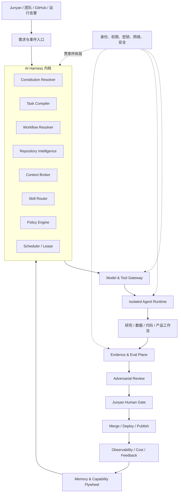
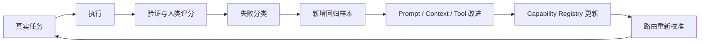

> **归档状态：SUPERSEDED_BY_V3**
> 本文完整保留为设计输入。现行唯一战略入口为 `docs/llm/AR_AIOS_MASTER_BLUEPRINT_v3.md`。若本文与 v3 冲突，以 v3 为准。

# AR AIOS 完整设计方案 v1

**状态：PROPOSED**
**最终负责人：Junyan**
**项目主管：Simon**
**核心建设成员：Reed、Jason、Better、Simon**

## 一、最终定义

AR AIOS 不是一个聊天机器人集合，也不是简单的多模型路由器。

它是一套围绕 AR 研究模型、软件系统与团队协作建立的智能生产操作系统：

> **Research OS 定义研究应该如何判断；AIOS 负责理解、规划、执行、验证与学习；Product OS 负责把能力交付给人。**

AIOS 的核心目标有两个：

1. 建立完整 AI 生产生态，提高研究、数据、代码和产品工作的效率与质量。
2. 建立统一 Harness，使任何模型进入 AR 后都能理解宪法、团队、文件关系和工作风格，并精准完成任务。

短期不训练基础模型。AR 的核心资产应当是：

- 研究宪法；
- 领域数据与数据合同；
- 团队工作流；
- 高质量上下文；
- Skills；
- 任务与能力评测；
- 失败和决策记忆；
- 人类反馈形成的能力飞轮。

---

# 二、系统总架构



系统分为八个平面：

1. 宪法与治理平面；
2. Harness 控制平面；
3. 上下文与知识平面；
4. Skill 与工作流平面；
5. 模型、工具与执行平面；
6. Evidence、Eval 与质量平面；
7. 产品与协作平面；
8. 可观测性、成本、Memory 与能力飞轮。

---

# 三、北极星工作链

所有非简单任务必须遵循：

```text
INTAKE
→ RESOLVE_AUTHORITY
→ COMPILE_TASK
→ RESOLVE_WORKFLOW
→ LOCATE
→ ANALYZE_IMPACT
→ BUILD_CONTEXT
→ POLICY_CHECK
→ ROUTE_SKILLS_AND_MODEL
→ CLAIM_AND_ISOLATE
→ EXECUTE
→ VERIFY
→ ADVERSARIAL_REVIEW
→ HUMAN_APPROVAL
→ MERGE/DEPLOY
→ RECONCILE
→ DISTILL_MEMORY
```

禁止的跳跃包括：

- 从自然语言需求直接执行；
- 从代码完成直接声明 DONE；
- 从 CI 通过直接推断生产验证；
- 从模型自我评价直接进入合并；
- 从历史聊天直接恢复任务，而不重新验证当前事实源。

---

# 四、宪法与治理平面

## 4.1 统一权威体系

建立机器可读的 `authority-graph.v1`，统一管理：

- Junyan 当前明确指令；
- 根目录 `AGENTS.md`；
- 最近模块级 `AGENTS.md`；
- `ai-task.v1`；
- 研究宪法与数据合同；
- 产品架构与 API 合同；
- 已批准的 Decision Manifest；
- 历史材料和兼容文档。

权威顺序建议固定为：

1. Junyan 当前明确指令；
2. 机器可读的 Human Decision；
3. 根级及最近模块级 `AGENTS.md`；
4. 当前任务 `ai-task.v1`；
5. 任务引用的现行合同与架构；
6. 历史文档、聊天摘要和 Memory。

`CLAUDE.md` 等历史文件可以提供背景，但不能自动覆盖现行团队合同。

## 4.2 宪法状态

统一使用：

- `AUTHORITY_READY`
- `AUTHORITY_STALE`
- `AUTHORITY_CONFLICT`
- `SPEC_BLOCKED`
- `POLICY_BLOCKED`
- `CONSTITUTIONAL_DECISION_REQUIRED`

模型不能自行调和宪法级冲突。涉及以下内容时必须交给 Junyan：

- 研究方法论；
- 资金与交易规则；
- 生产数据迁移；
- 删除历史记录；
- 权限提升；
- PR 最终合并；
- 生产部署。

## 4.3 团队风格契约

增加 `team-style.v1.json`，固化 AR 的工作风格：

1. 结论先行。
2. 事实、推断和建议分开。
3. 先找根因，再修改。
4. Findings 按严重度排序。
5. 不把旧 CI 当作当前 head 证据。
6. 不把 `PARTIAL`、`STALE` 或缺失数据写成 PASS。
7. 跨文件修改必须列出 producer、schema、consumer 和 test。
8. 每项工作必须有 owner、blocker、next。
9. 研究输出必须保留非自动交易边界。
10. 模型不得为了迎合负责人而隐藏反证。

---

# 五、AI Harness 控制平面

Harness 是整个 AIOS 的内核。

## 5.1 Session Bootstrap

每次会话启动时生成 `session-state.v1`：

- 当前仓库；
- Git remote；
- 当前 branch/worktree；
- `HEAD` 与 `origin/main`；
- dirty paths；
- 适用的 instruction files；
- 可用 Skills；
- Python、Node、Git、Codex 环境；
- 当前任务；
- 当前 CLAIM；
- 权限与网络状态。

如果工作区不安全，停止后续执行。

## 5.2 Task Compiler

将自然语言需求编译成 `ai-task.v1`：

- objective；
- non-goals；
- human owner；
- reviewer；
- authority docs；
- dependencies；
- file scope；
- forbidden scope；
- input/output contracts；
- acceptance tests；
- failure case；
- risk level；
- network policy；
- budget；
- approval gates。

字段缺失不得由模型静默补全。

## 5.3 Workflow Resolver

根据任务类型读取 `team-topology.v1` 和工作流模板，确定：

- 谁负责；
- 谁复核；
- 哪些成员必须参与；
- 任务属于 research、data、aios 或 product；
- 前置任务；
- 合并顺序；
- 必须产生的证据；
- Junyan 何时介入。

## 5.4 Scheduler 与协作状态

统一任务状态：

```text
DISCOVERED
→ TRIAGED
→ SPEC_READY
→ CLAIMED
→ RUNNING
→ VERIFYING
→ REVIEWING
→ AWAITING_APPROVAL
→ MERGED
→ DEPLOYED/VALIDATING
→ DONE
```

异常状态：

- `SPEC_BLOCKED`
- `POLICY_BLOCKED`
- `DATA_BLOCKED`
- `FAILED`
- `RELEASED`
- `SUPERSEDED`
- `RETIRED`

Scheduler 负责：

- 依赖图；
- CLAIM；
- lease/heartbeat；
- 文件冲突；
- 并发控制；
- PR 合并后的上下文失效；
- 任务超时和安全释放。

---

# 六、上下文窗口与知识系统

## 6.1 核心原则

上下文管理的目标不是“多读”，而是：

> 在正确阶段加载最少、最新、可追踪且足够完成任务的信息。

## 6.2 六级上下文

| 层级 | 内容 | 加载规则 |
|---|---|---|
| L0 | 宪法、安全、最终权限 | 每次加载，保持极短 |
| L1 | 当前 task contract | 当前任务必载 |
| L2 | 模块级规则 | 只加载目标模块 |
| L3 | 代码、schema、producer、consumer、test | 根据定位结果加载 |
| L4 | Issue、PR、决策、故障和协作状态 | 按任务关系加载 |
| L5 | 网页、PDF、公告、外部 Prompt | 隔离为 UNTRUSTED |

## 6.3 Context Pack

每个阶段生成 `ar-context-pack.v1`：

```json
{
  "schema": "ar-context-pack.v1",
  "task_id": "issue-xxx",
  "phase": "IMPLEMENT",
  "main_sha": "768c326...",
  "authority_hash": "...",
  "repo_map_version": "...",
  "included_chunks": [
    {
      "source": "path/to/file.py",
      "lines": "40-120",
      "reason": "production entry dependency",
      "content_hash": "..."
    }
  ],
  "unresolved_conflicts": [],
  "freshness": "CURRENT"
}
```

每个上下文片段必须携带：

- 来源；
- 行号或结构定位；
- 载入原因；
- 内容 hash；
- freshness；
- authority 等级；
- trusted/untrusted 标识。

## 6.4 窗口管理策略

1. 宪法与 task 只保留精简版本。
2. 大型文档通过按需 reference 和检索模式读取。
3. 实施阶段不持续保留大量需求讨论。
4. 验证阶段优先保留当前 diff、测试和失败输出。
5. Review 阶段重新构建独立上下文，避免继承执行者偏见。
6. 窗口接近上限时生成 checkpoint，不做无来源自由摘要。
7. 会话恢复时重新验证 SHA、规则 hash、PR 和 CLAIM。
8. `main` 或相关合同改变时，现有 Context Pack 自动变为 `STALE`。

---

# 七、Repository Intelligence：跨文件精准定位

系统需要建立 Repository Intelligence Map，而不只是关键词搜索。

## 7.1 六张关系图

1. **Symbol Graph**：函数、类、模块、import、调用关系。
2. **Data Lineage Graph**：producer → schema → artifact → consumer。
3. **Test Map**：功能 → 测试 → CI workflow。
4. **Ownership Map**：目录/合同 → owner → reviewer。
5. **Decision Map**：规则/文件 → Issue → PR → Human Decision。
6. **Incident Map**：故障 → 根因 → 修复 → 回归测试。

## 7.2 定位流程

```text
需求概念提取
→ 识别任务类型
→ 搜索候选符号和文件
→ 验证真实生产入口
→ 沿调用和数据关系扩展
→ 定位 schema、producer、consumer
→ 定位测试与 CI
→ 定位 owner、活跃 PR 和历史故障
→ 输出 change-map
```

输出 `change-map.v1`：

- primary files；
- dependent files；
- contracts；
- producers；
- consumers；
- tests；
- CI；
- owners；
- active PR conflicts；
- likely blast radius；
- recommended file scope；
- confidence 与未确认项。

未经真实代码关系验证，模型不能把搜索命中称为“根因定位”。

---

# 八、Skill Mesh 与 Skill Chain

## 8.1 设计原则

采用：

- 一个轻量编排 Skill；
- 多个原子 Skill；
- 详细知识放在按需 references；
- 脆弱操作使用确定性 scripts；
- Skill 输出采用稳定 schema；
- Skill 之间传递结构化制品，而不是自然语言摘要。

避免一个巨型 Skill 同时包含全部团队历史和规则。

## 8.2 核心 Skill Chain

| 顺序 | Skill | 输出 |
|---|---|---|
| 1 | `ar-start-session` | `session-state.v1` |
| 2 | `ar-resolve-authority` | `authority-pack.v1` |
| 3 | `ar-compile-task` | `ai-task.v1` |
| 4 | `ar-resolve-workflow` | `workflow-plan.v1` |
| 5 | `ar-locate-change` | `change-map.v1` |
| 6 | `ar-build-context` | `context-pack.v1` |
| 7 | `ar-analyze-impact` | `impact-report.v1` |
| 8 | 领域施工 Skill | 代码、合同或文档 |
| 9 | `ar-verify-delivery` | `ai-verify.v1` |
| 10 | `ar-adversarial-review` | `ai-review.v1` |
| 11 | `ar-handoff-task` | `handoff.v1` |
| 12 | `ar-distill-memory` | `ai-memory.v1` |

外层 Skill：

### `ar-work-harness`

负责：

- 判断任务类型；
- 选择 Skill Chain；
- 检查每一阶段输出；
- 控制权限和上下文；
- 在阻断状态停止；
- 生成端到端 evidence chain。

## 8.3 领域 Skills

保留并扩展现有能力：

- `ar-aios-engineering`
- `ar-product-engineering`
- `ar-research-framework`
- `ar-adversarial-review`
- `ar-task-delivery`
- `ar-workspace-sync`

建议新增：

- `ar-data-contract-engineering`
- `ar-research-evidence-review`
- `ar-pr-cleanup`
- `ar-incident-response`
- `ar-model-evaluation`
- `ar-release-verification`

---

# 九、模型、工具和执行平面

## 9.1 Model Gateway

统一所有模型：

- OpenAI；
- Claude；
- Kimi；
- 后续本地或云模型；
- deterministic workers。

统一接口必须记录：

- provider；
- model；
- model version；
- prompt version；
- task type；
- context hash；
- structured output schema；
- timeout；
- token usage；
- cost；
- error class；
- retry；
- output hash。

路由依据：

- 任务类型；
- 允许工具；
- 文件范围；
- 网络权限；
- Eval 结果；
- 已知失败；
- 延迟；
- 成本；
- 风险等级；
- reviewer 独立性。

这对应当前市场真实需求中的 Agent Infrastructure、Evals、Data Platform、Security、Reliability 和 AI Product，而非单纯 Prompt 使用。[OpenAI Agent Infrastructure](https://openai.com/careers/software-engineer-agent-infrastructure-san-francisco/)、[OpenAI Evals](https://openai.com/careers/backend-software-engineer-%28evals%29-san-francisco/)、[Anthropic Careers](https://www.anthropic.com/careers/jobs?hsLang=en)

## 9.2 Tool Gateway

工具必须登记：

- capability；
- read/write；
- scope；
- network；
- secret requirement；
- risk；
- side effects；
- approval requirement；
- audit behavior。

模型不能直接获得整台机器权限。

## 9.3 隔离运行时

每次 run 绑定：

- task；
- branch；
- worktree；
- commit；
- file scope；
- tools；
- network policy；
- timeout；
- budget；
- human owner。

需要支持：

- 最小权限；
- 默认离线；
- sandbox/container；
- 幂等；
- timeout kill；
- cancellation；
- cleanup；
- retry；
- checkpoint；
- 禁止直推 `main`；
- 可审计的文件与命令记录。

---

# 十、Evidence、Eval 与质量系统

## 10.1 Evidence Chain

每个任务至少产生：

1. `ai-task.v1`
2. `authority-pack.v1`
3. `context-pack.v1`
4. `ai-run.v1`
5. `ai-artifact.v1`
6. `ai-verify.v1`
7. `ai-review.v1`
8. `ai-decision.v1`
9. `handoff.v1`
10. `ai-memory.v1`

## 10.2 Eval 类型

### 能力 Eval

评估模型是否适合某类任务：

- 代码修改；
- PR Review；
- 研究证据抽取；
- 数据合同；
- 前端实现；
- 故障诊断；
- 架构设计。

### Harness Eval

评估系统是否正确工作：

1. 模糊需求能否找到正确文件和测试；
2. 宪法冲突能否被阻断；
3. 恶意外部指令是否被隔离；
4. 跨会话能否重建等价上下文；
5. `main` 改变后是否标记上下文过期；
6. 是否能识别跨文件影响；
7. 是否会过度声明完成；
8. 是否遵守团队风格和 owner 边界。

### 生产 Eval

- golden dataset；
- 回归测试；
- current-head CI；
- Shadow；
- Canary；
- drift monitoring；
- human acceptance；
- failure taxonomy。

执行 Agent 不能成为自己的唯一 Reviewer。LLM-as-judge 只能提供辅助证据。

---

# 十一、安全模型

安全能力贯穿全部平面：

1. 身份和角色权限；
2. secrets vault；
3. 网络默认拒绝；
4. 外部内容标记为不可信；
5. prompt injection 检测；
6. 路径和工具 allowlist；
7. 日志脱敏；
8. 环境隔离；
9. 数据分级；
10. 高风险双重 Review；
11. 审计与回滚；
12. 紧急停止开关。

风险等级：

| 等级 | 示例 | 自动化边界 |
|---|---|---|
| LOW | 文档、离线分析 | 可自动执行和验证 |
| MEDIUM | 普通代码、前端 | PR + 独立 Review |
| HIGH | workflow、权限、生产数据 | 双重 Review + Junyan |
| CONSTITUTIONAL | 研究规则、资金规则、最终权限 | 只能提案，Junyan 决定 |

---

# 十二、产品与协作平面

AIOS 控制台应提供：

- 当前任务和依赖图；
- 每位成员的 CLAIM；
- Context Pack 和 freshness；
- PR 和 CI；
- 模型、Skill 与工具调用；
- 成本和延迟；
- verification；
- findings；
- Human Gate；
- blocked/stale 状态；
- capability matrix；
- weekly digest。

前端是只读投影，不成为事实源，也不直接调用模型供应商或修改研究状态。

---

# 十三、Memory 与能力飞轮



Memory 只允许记录：

- symptom；
- root cause；
- decision；
- implementation；
- regression test；
- residual risk；
- reusable proposal；
- evidence refs。

Memory 不得直接修改宪法。可复用规则初始状态为 `PROPOSED`，批准后才生效。

---

# 十四、团队组织设计

| 成员 | 主专业 | 副专业 | 系统责任 |
|---|---|---|---|
| Junyan | AI Systems Product Owner | Domain Governance | 宪法、优先级、研究标准、最终审批 |
| Simon | Technical AI PM / Context Architect | Knowledge Engineering | 系统架构、任务拆解、Workflow、Context、跨组推进 |
| Reed | Agent Platform Engineer | Model Integration | Task、Registry、Scheduler、Adapter、Router、Gateway |
| Jason | AI Reliability & Security Engineer | Agent Runtime | Policy、Isolation、Evals、Verifier、安全、CI |
| Better | AI Product Engineer | Developer Experience | 控制台、API/SDK、工作流 UI、反馈采集、产品接入 |

固定交叉 Review：

- Reed ↔ Jason：平台、运行时、安全和 Evals；
- Better ↔ Simon：产品、Context、任务和 UX；
- Junyan：只介入关键决策门，不处理所有日常实现细节。

---

# 十五、共同技能底座

四位成员都需要掌握：

1. Python、TypeScript、Git、CI/CD；
2. API、SQL、JSON Schema；
3. LLM structured output、tool use、错误模式；
4. Prompt 与 Context Engineering；
5. RAG 和知识检索；
6. Agent 状态机、调度、幂等、重试；
7. sandbox 与最小权限；
8. Eval dataset 和回归测试；
9. tracing、日志、成本和可靠性；
10. AR 研究合同、证据等级和审批边界。

每个人必须交付真实 vertical slice，不能只提交学习笔记。

---

# 十六、工程目录建议

```text
config/aios/
  authority-graph.v1.json
  team-topology.v1.json
  team-style.v1.json
  workflow-templates.v1.json
  skill-registry.v1.json
  model-registry.v1.json
  tool-registry.v1.json

scripts/llm/ai_os/
  harness.py
  constitution_resolver.py
  task_compiler.py
  workflow_resolver.py
  repo_mapper.py
  impact_analyzer.py
  context_broker.py
  skill_router.py
  policy_engine.py
  scheduler.py
  capability.py
  executor.py
  verifier.py
  reviewer.py
  reconciler.py
  memory_distiller.py
  projection.py

scripts/llm/schemas/
  authority-pack.schema.json
  context-pack.schema.json
  change-map.schema.json
  workflow-plan.schema.json
  run.schema.json
  artifact.schema.json
  verify.schema.json
  review.schema.json
  handoff.schema.json
  memory.schema.json

.agents/skills/
  ar-work-harness/
  ar-start-session/
  ar-resolve-authority/
  ar-compile-task/
  ar-resolve-workflow/
  ar-locate-change/
  ar-build-context/
  ar-analyze-impact/
  ar-verify-delivery/
  ar-handoff-task/
  ar-distill-memory/
  ...domain skills

tests/ai_os/
  harness/
  constitution/
  context/
  repo_intelligence/
  skills/
  runtime/
  evals/
  security/
```

---

# 十七、建设路线

## Phase 0：统一事实源

- 清理历史 PR；
- 合并团队同步政策；
- 确认 canonical workspace；
- Simon 提交统一架构和真实 task source；
- 清理过期 CLAIM；
- 建立本方案唯一权威文档。

## Phase 1：Harness MVP

实施：

- A-028 Constitution Graph；
- A-029 Team Workflow Digital Twin；
- A-030 Repository Intelligence Map；
- A-031 Context Broker；
- A-032 Skill Registry 与 Chain；
- A-033 Session Resume；
- A-034 Impact Analyzer；
- A-035 Harness Evals；
- A-036 Team Style 与 Decision Memory。

阶段验收：

```text
自然语言需求
→ 权威解析
→ Task
→ 文件定位
→ Context Pack
→ Skill Chain
→ 隔离执行计划
→ Verify
→ Review
→ Handoff
```

## Phase 2：可信单 Agent 生产

优先支持：

1. 代码修改；
2. PR Review；
3. 数据诊断；
4. 文档/合同同步；
5. 前端契约消费。

禁止自动生产写入。

## Phase 3：多 Agent 与团队生产

- Scheduler；
- leases；
- 多模型路由；
- 独立 Reviewer；
- AIOS 控制台；
- 成本与健康监控；
- 研究、数据、代码、产品四条工作流。

## Phase 4：能力飞轮

积累足够真实任务后再推进：

- 领域 RAG；
- Prompt 自动优化；
- 动态路由；
- 蒸馏；
- 微调；
- 更高自治等级。

---

# 十八、成功指标

第一阶段先采集基线，不预设未经验证的漂亮数字。

核心指标：

- 文件定位正确率；
- 关键依赖召回率；
- Context stale 发现率；
- 宪法冲突漏检率；
- 首次验收通过率；
- 回归逃逸率；
- 人工修正次数；
- 任务到合并周期；
- 单个有效交付成本；
- 模型重试率；
- 会话恢复一致性；
- Skill 选择正确率；
- 人类接受/拒绝原因分布。

真正的系统成功不是模型回答更长，而是：

> 更少读错规则、更少改错文件、更少重复工作、更少过度申报，并以更短时间交付可验证成果。

---

# 十九、当前基础与目标差距

当前已经拥有：

- 根级和模块级 `AGENTS.md`；
- Task Compiler；
- Registry；
- Reconciler；
- Capability Router；
- Workspace Doctor；
- 六个 repo Skills；
- Issue #164 协作事件；
- AIOS 工程总账。

当前缺失的关键内核：

- Authority Graph；
- Constitution Resolver；
- Context Broker；
- Repository Intelligence；
- Impact Analyzer；
- Team Workflow Digital Twin；
- Skill Chain Compiler；
- session rehydration；
- Harness Evals；
- 完整 evidence chain；
- 控制台与可观测性。

因此当前成熟度可以描述为：

> **已有若干可靠控制组件，但尚未形成端到端 AI Harness。**

---

# 二十、最终验收标准

AR AIOS v1 只有在以下场景全部通过后，才能称为建成第一版：

1. 模糊需求能定位真实入口、合同、producer、consumer 和测试。
2. 宪法冲突时系统停止，而不是自行解释。
3. 不相关文件不会大量进入上下文。
4. Mac/Windows 切换不依赖绝对路径。
5. 会话丢失后能根据 SHA 和 manifests 恢复。
6. 外部恶意指令不会进入可信控制区。
7. PR 合并后依赖任务会被标记 stale。
8. 执行者不能单独完成最终复核。
9. DONE 能区分 delivered、merged、deployed、production-verified。
10. 新模型接入只需 adapter、capability record 和 eval，不需重写工作流。
11. 四位成员能够独立完成一条端到端 vertical slice。
12. Junyan 保留研究、生产、资金和合并最终权力。

建议将本方案落为唯一权威文档：

`docs/llm/AR_AIOS_ECOSYSTEM_AND_HARNESS_ARCHITECTURE_v1.md`

其他 AIOS 文档、工程总账、Skills 和团队规范都从该文档向下引用，避免重新出现多个“大纲都像权威”的情况。Skill 部分采用了渐进式加载和原子化编排原则，确保系统能力增长时不会反过来耗尽上下文窗口。
