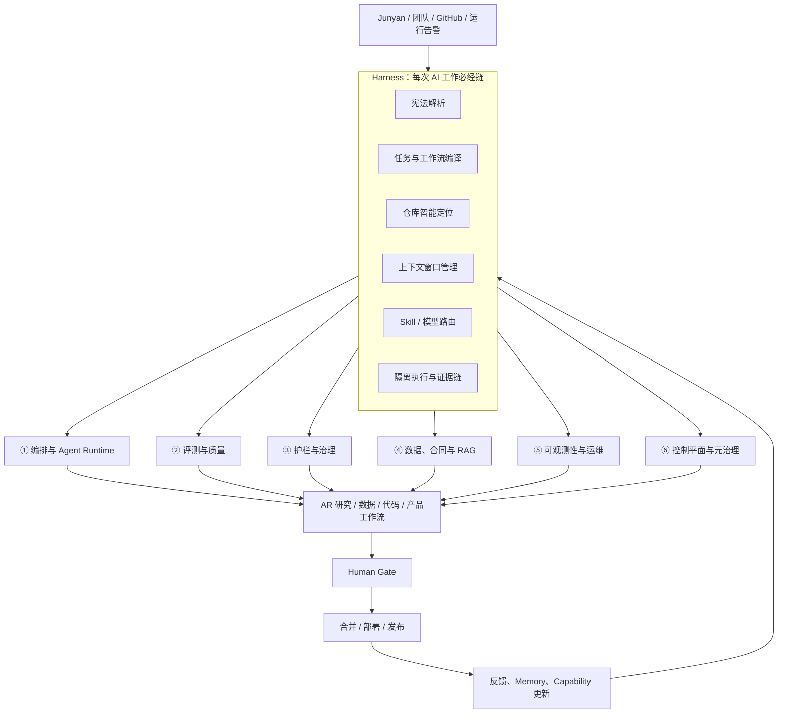

> **归档状态：SUPERSEDED_BY_V3**
> 本文完整保留为设计输入。现行唯一战略入口为 `docs/llm/AR_AIOS_MASTER_BLUEPRINT_v3.md`。若本文与 v3 冲突，以 v3 为准。

# AR AIOS 总蓝图 v2

**版本状态：战略定稿候选（PROPOSED）**
**最终负责人：Junyan**
**项目主管：Simon**
**建设成员：Reed、Jason、Better、Simon**

> 说明：当前 Windows 工作区未检索到 Claude 提到的 `AR/AIOS_生态架构_v1.md`，因此本版依据你贴出的六层设计、此前 Harness 方案和仓库现有资产合成。本版内容可以独立成立；找到原文后应做一次差异审计，不应让两份文档并行成为权威。

---

## 一、最终战略判断

AR AIOS 应正式定义为：

> **套在 AR 研究模型外的 AI 工程操作系统，同时也是四位成员的 AI Engineering 实训系统。**

它承担三项任务：

1. **赋能模型**：让 AI 能理解 AR 宪法、团队流程、工作风格和仓库结构，并能精准执行。
2. **约束模型**：让每项产出在被采纳前经过合同、护栏、评测、证据和人类审批。
3. **培养团队**：让四人分别建设并长期维护 AIOS 的真实工程层，形成可验证、可写入简历的能力。

最终架构不是单纯的六层，也不是单纯的 Harness，而是：

> **一个 Harness 内核 + 六个工程能力层 + 一条 Evidence Chain + 一套人类学习飞轮。**

---

# 二、系统的双重属性

## 2.1 它首先是 AR 的生产系统

AIOS 把工作从：

```text
Junyan 提需求
→ AI 根据聊天理解
→ 生成结果
→ 人工判断能不能信
```

升级为：

```text
需求
→ 宪法解析
→ 任务合同
→ 文件与依赖定位
→ 最小可信上下文
→ Skill / 模型路由
→ 隔离执行
→ 自动验证
→ 独立对抗复核
→ Junyan 审批
→ 合并/发布
→ 反馈进入评测和 Memory
```

## 2.2 它同时是四人的学习系统

六个工程层对应当前真实 AI 岗位中的主要能力族：

- Agent Infrastructure / Orchestration
- Evals / Model Quality
- Guardrails / AI Security
- Data Contracts / RAG / Knowledge
- LLMOps / Observability / Reliability
- AI Platform / Developer Productivity / Technical AI PM

当前市场已经明显从笼统的“会用 AI”走向上述专业分工。OpenAI 当前岗位直接包含 Agent Infrastructure、Evals、Security、Observability、Data Infrastructure 和 Agents PM；Anthropic 也将 Research Tools、Safeguards、Data Platform、Sandboxing 等拆为独立能力方向。[OpenAI Agent Infrastructure](https://openai.com/careers/software-engineer-agent-infrastructure-san-francisco/)、[OpenAI Evals](https://openai.com/careers/backend-software-engineer-%28evals%29-san-francisco/)、[OpenAI Agents PM](https://openai.com/careers/product-manager-api-agents-san-francisco/)、[Anthropic Careers](https://www.anthropic.com/careers/jobs?hsLang=en)

这也符合更广泛的就业趋势：WEF 将 AI/大数据和网络安全列为增长最快的技术技能，PwC 则发现 AI 高暴露岗位的技能要求变化速度显著更快。[WEF Future of Jobs 2025](https://www.weforum.org/press/2025/01/future-of-jobs-report-2025-78-million-new-job-opportunities-by-2030-but-urgent-upskilling-needed-to-prepare-workforces//)、[PwC AI Jobs Barometer](https://www.pwc.com/gx/en/news-room/press-releases/2025/ai-linked-to-a-fourfold-increase-in-productivity-growth.html)

---

# 三、总体架构：一个内核、六个能力层



## 关键区分

- **Harness 是内核**：规定每次任务如何理解、定位、取上下文、执行和验收。
- **六层是能力部门**：分别建设 Harness 所调用的工程能力。
- **第六层控制平面不是 Harness 本身**：它负责配置、管理、展示和治理 Harness。
- **Skills 不是系统本身**：Skills 是 Harness 调用的标准作业程序。

---

# 四、AI Harness 内核

## 4.1 Constitution Resolver：统一宪法

建立机器可读的 `authority-graph.v1`，统一：

- Junyan 当前明确指令；
- Human Decision Manifest；
- 根级 `AGENTS.md`；
- 最近模块级 `AGENTS.md`；
- 当前 `ai-task.v1`；
- 研究、产品、数据合同；
- 历史文档与兼容材料。

权威顺序：

1. Junyan 当前明确指令；
2. 已记录的人类决策；
3. 根级和最近模块级 `AGENTS.md`；
4. 当前任务合同；
5. 任务引用的现行合同；
6. 历史文档、聊天摘要与 Memory。

统一阻断状态：

- `AUTHORITY_STALE`
- `AUTHORITY_CONFLICT`
- `SPEC_BLOCKED`
- `POLICY_BLOCKED`
- `CONSTITUTIONAL_DECISION_REQUIRED`

模型不得自行调和宪法级冲突。

## 4.2 Task Compiler：需求转任务合同

所有非简单工作编译为 `ai-task.v1`：

- objective；
- non-goals；
- owner/reviewer；
- dependencies；
- authority docs；
- file/forbidden scope；
- input/output contracts；
- acceptance tests；
- failure case；
- risk；
- network；
- budget；
- approval gates。

缺失字段不得由模型静默猜测。

## 4.3 Workflow Resolver：理解团队工作方式

建立 `team-topology.v1` 和 `workflow-templates.v1`，机器化描述：

- 谁负责哪一层；
- 谁必须 Review；
- 什么任务走什么流程；
- 哪些任务可以并行；
- 哪些 PR 必须按顺序合并；
- 哪些动作必须由 Junyan 批准；
- 什么条件才算完成。

工作流模板至少覆盖：

- AIOS 功能；
- 研究功能；
- 数据发布；
- 前端产品；
- PR Review；
- 故障修复；
- 多端迁移；
- 宪法或政策修改。

## 4.4 Repository Intelligence：跨文件精准定位

建立六张关系图：

1. Symbol Graph；
2. producer → schema → artifact → consumer 数据链；
3. 功能 → 测试 → CI 映射；
4. 文件 → owner → reviewer 映射；
5. 文件/规则 → Issue → PR → Decision 映射；
6. 故障 → 根因 → 修复 → 回归测试映射。

需求定位必须经过：

```text
概念提取
→ 候选文件
→ 验证真实入口
→ 扩展调用关系
→ 查找 producer/schema/consumer
→ 查找测试与 CI
→ 查找 owner、活跃 PR 和历史故障
```

输出 `change-map.v1`，而不是只返回关键词命中的文件列表。

## 4.5 Context Broker：上下文窗口管理

上下文分为六级：

| 层级 | 内容 | 规则 |
|---|---|---|
| L0 | 宪法、安全、最终权限 | 每次加载，必须短 |
| L1 | 当前任务合同 | 当前任务必载 |
| L2 | 模块规则 | 只加载相关模块 |
| L3 | 代码、schema、producer、consumer、test | 按定位结果加载 |
| L4 | Issue、PR、决策、故障、CLAIM | 按关系加载 |
| L5 | 网页、PDF、外部 Prompt | 隔离为 UNTRUSTED |

每个阶段生成 `context-pack.v1`，记录：

- main SHA；
- authority hash；
- phase；
- 文件和行号；
- 加载原因；
- content hash；
- freshness；
- trusted/untrusted；
- 未解决冲突。

会话恢复时从事实源重建，不依赖模型对旧聊天的自由记忆。

## 4.6 Skill Router：能力链编排

建立一个轻量 `ar-work-harness`，负责调用原子 Skills：

```text
ar-start-session
→ ar-resolve-authority
→ ar-compile-task
→ ar-resolve-workflow
→ ar-locate-change
→ ar-build-context
→ ar-analyze-impact
→ 领域施工 Skill
→ ar-verify-delivery
→ ar-adversarial-review
→ ar-handoff-task
→ ar-distill-memory
```

每个 Skill 应当：

- 有明确触发条件；
- 输入输出使用稳定 schema；
- 详细知识放入按需 references；
- 脆弱操作使用确定性 scripts；
- 不自行提升权限；
- 有自己的 Eval；
- 保持短小，避免制造超级 Prompt。

---

# 五、六个工程能力层

## ① 编排与 Agent Runtime

**定位：AIOS 的神经传导与执行系统。**

### AR 已有

- Task Compiler；
- Registry；
- Reconciler；
- Capability Router；
- 部分模型 adapter；
- worktree/branch 工作流；
- Isolation Planner 设计。

### v2 建设内容

- 统一 AgentAdapter；
- Model/Tool Registry；
- Skill Chain Compiler；
- Scheduler 和依赖 DAG；
- CLAIM、lease、heartbeat；
- 隔离 executor；
- timeout、cancel、retry、cleanup；
- 幂等和 checkpoint；
- 多模型 fallback；
- run 与 commit 强绑定。

### JD 技能

- Agent infrastructure；
- tool calling / MCP；
- workflow orchestration；
- APIs；
- state machine；
- retry/idempotency；
- sandboxing；
- distributed-systems thinking。

### 人员

- **主负责人：Reed**
- **复核：Jason**
- **第5层运行后端副负责人：Reed**

### 第一项学习任务

跑通现有 adapter、Registry 和 Router 测试，画出一次任务从 task 到 route decision 的状态图，再实现一个无副作用的 deterministic worker。

### v1 验收

同一 task/input/context/commit 重跑不得重复产生副作用；中断后能安全恢复或清理；未授权工具和路径必须在执行前被拒绝。

---

## ② 评测与质量

**定位：AIOS 最有差异化的质量资产。**

### AR 已有

- Eval Set；
- offline tests；
- governance mutation；
- adversarial review Skill；
- fail-closed 测试文化。

### v2 建设内容

- Eval Registry；
- task-specific golden datasets；
- Context/Eval 数据集；
- deterministic scoring；
- human rubric；
- LLM-as-judge 校准；
- current-head continuous eval；
- regression/drift monitoring；
- mutation testing；
- false-pass 与 false-rejection 测试；
- 模型/Prompt/Context 版本比较。

### JD 技能

- eval pipelines；
- golden datasets；
- experiment design；
- regression monitoring；
- error taxonomy；
- model quality；
- human feedback loops。

### 人员

- **主负责人：Jason**
- **复核：Reed**
- **研究判分标准：Junyan**

### 第一项学习任务

选择一个真实治理门，将其安全删除或弱化，证明指定测试会因正确原因翻红。

### v1 验收

每个高风险门都至少有一个负向回归；评测能够区分“模型输出更好”和“测试本身放水”；评测结果绑定 model、prompt、context 和 commit。

---

## ③ 护栏与治理

**定位：AIOS 的免疫系统。**

### AR 已有

- AGENTS 规则；
- Policy Engine 草案；
- no-network tests；
- fail-closed Router；
- 最终审批边界；
- secret handling 规范。

### v2 建设内容

- Authority Resolver；
- Policy Engine；
- role/file/network/budget/risk gates；
- prompt injection 防护；
- secret scanning；
- tool/path allowlist；
- Human Gate；
- audit logging；
- reviewer independence；
- sandbox 策略；
- threat model；
- incident response；
- rollback 与 kill switch。

### JD 技能

- guardrails；
- prompt injection；
- red teaming；
- IAM；
- security testing；
- audit logging；
- human oversight；
- AI governance。

### 人员

- **主负责人：Jason**
- **交叉复核：Reed**
- **HIGH/CONSTITUTIONAL：Junyan**

Jason 主学第②层，③层作为紧密相连的副专业，不另设无人负责的层。

### 新人入口

攻击侧可以先不写复杂代码：

1. 学习 prompt injection；
2. 编写攻击案例；
3. 观察系统为何被绕过；
4. 把事故变成回归测试；
5. 再实现防护。

### v1 验收

攻击输入不能进入可信控制区；PR 作者不能成为自己的唯一批准人；规则变化必须留下审计记录；审批在新 commit 后自动失效。

---

## ④ 数据、合同、Knowledge 与 RAG

**定位：让 AI 获得准确、按时间有效、带来源的 AR 知识。**

### AR 已有

- 大量研究文档；
- versioned JSON contracts；
- producer/consumer 数据链；
- evidence grade；
- freshness 与 partial 状态；
- 但没有统一 Knowledge/RAG 系统。

### v2 建设内容

- 文档与数据 source registry；
- metadata 与 schema；
- hybrid retrieval；
- lexical + semantic + graph expansion；
- reranking；
- citation；
- as-of retrieval；
- freshness；
- access control；
- decision/incident knowledge base；
- Repository Intelligence index；
- Context Pack assembly；
- RAG Eval；
- producer/schema/consumer lineage。

### JD 技能

- RAG infrastructure；
- embeddings；
- chunking；
- retrieval/reranking；
- data contracts；
- ETL；
- lineage；
- vector/keyword search；
- knowledge systems。

### 人员

- **主负责人：Better**
- **架构/任务复核：Simon**
- **接口复核：Reed**

### 新人第一项任务

用十份批准的 AR 决策文档建立一个 bounded demo，但先写问题集和正确来源，再建立索引。

必须区分：

- **2–3 周**：可以完成受指导的检索 Demo；
- **8–12 周**：才可能拥有带引用、freshness、as-of 和 Eval 的受限 v0；
- Demo 不等于 production RAG。

### v1 验收

回答必须带来源和 as-of；过期或冲突内容不能静默返回；检索不到时必须承认；权限外内容不得进入 Context Pack。

---

## ⑤ 可观测性与运维

**定位：让系统所有行为可追踪、可诊断、可控制成本。**

### AR 已有

- CI；
- Progress Board；
- Workspace Doctor；
- 部分 usage/cost ledger；
- 状态事件；
- 但缺少端到端 trace。

### v2 建设内容

- task/run/model/tool/skill spans；
- structured logs；
- run/artifact/verify manifests；
- latency、token、cost；
- retry 和 failure class；
- health checks；
- alerts；
- replay；
- current-head CI 绑定；
- deployment stage；
- incident runbooks；
- provider failure diagnostics；
- secret/credential health；
- 后续容器与云运行。

### JD 技能

- LLMOps；
- observability；
- tracing；
- SRE；
- CI/CD；
- reliability；
- secrets；
- containers；
- cloud operations。

### 人员

- **运行后端：Reed**
- **控制台展示：Better**
- **可靠性复核：Jason**

### v1 验收

任何失败都能回答“在哪一步、哪个模型、哪个 Context、什么工具、什么 commit、花费多少、是否重试”；代码交付、合并、部署和生产验证必须是不同状态。

---

## ⑥ 控制平面与元治理

**定位：AIOS 的管理后台和制度执行层。**

### AR 已有

- Issue #164；
- Workspace Doctor；
- 团队合同；
- Skills；
- AIOS Backlog；
- GitHub PR 流程；
- 但许多纪律仍主要依赖文档。

### v2 建设内容

- `team-topology.v1`；
- `team-style.v1`；
- workflow templates；
- Skill Registry；
- Model/Tool Registry；
- Capability Matrix；
- branch protection；
- CODEOWNERS；
- required checks；
- stale approval dismissal；
- PR/Decision/Human Gate；
- AIOS 控制台；
- weekly digest；
- policy/schema migration；
- architecture decision records。

### JD 技能

- AI platform；
- developer productivity；
- technical program management；
- policy-as-code；
- platform governance；
- workflow design；
- developer experience。

### 人员

- **主负责人：Simon**
- **机器执行复核：Jason**
- **最终批准：Junyan**

Simon 继续担任项目主管，但必须拥有真实技术制品，而不只是排期：

- canonical architecture；
- task architecture；
- workflow templates；
- ownership map；
- Context/Knowledge 路线；
- capability roadmap；
- PR 清场与依赖顺序。

### v1 验收

团队流程不再依赖“大家记得遵守”；main 直推、陈旧审批、自签、缺测试和越权路径由机器直接阻断。

---

# 六、六层如何收敛成四条学习路径

六层不能机械地分给六个人。最终采用四条 T 型路径：

| 成员 | 主学习路径 | 副专业 | 主要工程层 |
|---|---|---|---|
| Reed | Agent Platform Engineer | LLMOps | ① + ⑤后端 |
| Jason | AI Quality & Safety Engineer | Runtime Security | ② + ③ |
| Better | Knowledge/RAG & AI Product Engineer | Observability UI | ④ + ⑤展示 |
| Simon | Technical AI PM / Platform Governance | Context Architecture | ⑥ + Harness 工作流治理 |

Junyan 是 AI Systems Product Owner 和 Domain Governor，不承担普通层的日常施工。

Claude/Codex：

- 可以实施；
- 可以解释；
- 可以 Review；
- 可以生成测试；
- **不能成为任何层的人类 owner；**
- **不能替学习者完成“理解与拥有”。**

---

# 七、人类学习验收

一个成员不能因为 AI 帮他生成了 PR，就声称已经掌握该技能。

每层使用四级能力标准：

| 等级 | 含义 |
|---|---|
| L0 观察者 | 能运行系统和解释输入输出 |
| L1 贡献者 | 能修改受限组件并补测试 |
| L2 Owner | 能设计接口、实现失败路径并处理 Review |
| L3 Maintainer | 能处理事故、复核别人并演进架构 |

成员达到 L2 至少需要：

1. 亲自解释关键代码和架构决策；
2. 能复现一次真实失败；
3. 能在不依赖 AI 直接给答案的情况下定位根因；
4. 编写负向回归；
5. 接受一次对抗 Review；
6. Review 同层他人的 PR；
7. 编写限制和残余风险；
8. 处理一次合并后回归或模拟事故。

规划估算：

- **2–3 周**：完成受指导 Demo；
- **8–12 周**：拥有一个 bounded v0；
- **6 个月以上**：掌握复杂后半段，如 lease 调度、judge 校准、as-of RAG、容器、云、宪法迁移。

以上是学习规划估算，不是交付承诺。

---

# 八、机器证据链

每个非简单任务按风险生成：

1. `session-state.v1`
2. `authority-pack.v1`
3. `ai-task.v1`
4. `workflow-plan.v1`
5. `change-map.v1`
6. `context-pack.v1`
7. `ai-run.v1`
8. `ai-artifact.v1`
9. `ai-verify.v1`
10. `ai-review.v1`
11. `ai-decision.v1`
12. `handoff.v1`
13. `ai-memory.v1`

三道核心门：

```text
合同门：是否做对了被授权的任务
→ 护栏门：是否在权限、安全和风险范围内
→ 评测门：是否有证据证明结果真实有效
```

HIGH/CONSTITUTIONAL 任务之后还必须经过 Junyan Human Gate。

---

# 九、P0：先止血，再扩建

Claude 的判断正确：第一步不应是建立大型 RAG 或多 Agent Demo，而是把现有纸面纪律变成机器规则。

## P0-1 GitHub 保护

为 `main` 配置：

- 必须通过 PR；
- 禁止直接 push；
- 禁止 force push 和删除；
- required status checks；
- 要求分支基于最新 main；
- 新 commit 自动取消旧 approval；
- 必须解决 Review conversations；
- 关键路径要求 CODEOWNERS；
- PR 作者不能成为唯一批准人。

## P0-2 当前 head 证据

所有 Review、CI 和批准绑定：

- PR head SHA；
- base SHA；
- authority hash；
- context hash；
- test run；
- reviewer identity。

任何新 commit 自动令旧验证与旧批准进入 `STALE`。

## P0-3 Governance Mutation

所有宪法、权限、审批、网络和数据质量门必须通过：

- 正向测试；
- 负向测试；
- mutation test；
- current-head CI。

按你提供的内部复盘，“多次门存在但没有被测试守住”和“mutation 存活”应作为第一批 incident fixtures；在正式写入架构事实前，需要补对应 commit/test 证据。

## P0-4 唯一战略文档

批准后，将本蓝图落为：

`docs/llm/AR_AIOS_TOTAL_BLUEPRINT_v2.md`

其他文档关系：

- 本文：战略与组织总纲；
- AI OS Build Guide：工程实施细节；
- AI OS Backlog：A-ID 状态；
- AGENTS：运行规则；
- Skills：任务级标准程序；
- schemas/config：机器可执行合同。

---

# 十、三阶段路线

## Phase 1：Harness MVP，约 0–12 周

目标：

```text
自然语言需求
→ 宪法
→ Task
→ Repo 定位
→ Context Pack
→ Skill Chain
→ 执行计划
→ Verify
→ Review
→ Handoff
```

优先工程：

- A-028 Constitution Graph；
- A-029 Team Workflow Digital Twin；
- A-030 Repository Intelligence；
- A-031 Context Broker；
- A-032 Skill Registry/Chain；
- A-033 Session Resume；
- A-034 Impact Analyzer；
- A-035 Harness Evals；
- A-036 Team Style/Decision Memory。

## Phase 2：可信单 Agent 生产，约第3–6个月

优先支持：

1. PR Review；
2. 普通代码修改；
3. 数据诊断；
4. 合同同步；
5. 前端契约消费；
6. RAG 辅助定位。

本阶段仍禁止自动生产数据写入、自动合并和自动交易。

## Phase 3：多 Agent 与能力飞轮，6个月以后

- Scheduler 和 leases；
- 多模型路由；
- 独立 Review Agent；
- continuous eval；
- AIOS 控制台；
- Shadow/Canary；
- 云或容器运行；
- 领域 RAG；
- Prompt/Context 优化；
- 基于真实质量与成本的动态路由。

---

# 十一、第一周分工

## Junyan

1. 批准或修改本蓝图。
2. 确认最终组织分工。
3. 配置或批准 GitHub branch protection。
4. 明确 HIGH/CONSTITUTIONAL 审批边界。

## Simon

1. 将本蓝图拆成 milestone 和依赖图。
2. 建立 team topology、owner/reviewer map。
3. 输出 P0 GitHub 控制清单。
4. 给每人生成第一份真实 task contract。

## Reed

1. 绘制现有 Task → Registry → Router → Run 的实际链路。
2. 列出现有 Adapter、Scheduler、Executor 缺口。
3. 确认 CI required-check 名称和 current-head 绑定方案。
4. 不开始多 Agent 并发。

## Jason

1. 将近期治理事故转换为 regression/mutation fixtures。
2. 设计 approval、prompt injection、secret、network 四类攻击测试。
3. 验证作者不能自签、旧批准不能跨 commit 有效。
4. 建立 Eval Registry v0 规格。

## Better

1. 清点首批 Knowledge/RAG 文档，不直接开始大规模 embedding。
2. 先建立查询集、正确答案来源和 citation contract。
3. 选择十份批准文档做 bounded demo。
4. 暂不建设 AIOS 大屏，先保证数据与事件合同稳定。

---

# 十二、三个北极星指标

## 1. 可信交付率

具备 current-head task、verify、review 和 decision 证据的交付，占全部完成申报的比例。

## 2. Time to Trust

从需求进入系统，到独立 Reviewer 能基于完整证据做出判断的时间。

不是“AI 第一次输出用了多久”。

## 3. Human Ownership Rate

成员能解释、复现、修复和复核自己负责层的交付比例。

不是 AI 生成代码占比。

辅助指标包括：

- 文件定位准确率；
- 关键依赖召回率；
- stale context 使用率；
- 宪法冲突漏检率；
- 回归逃逸率；
- mutation kill rate；
- RAG citation accuracy；
- 人工返工次数；
- 单位可信交付成本；
- incident 恢复时间。

第一阶段先采集基线，不预设未经验证的漂亮目标。

---

# 十三、明确不做什么

v2 前期禁止：

1. 训练自己的基础模型；
2. 在单 Agent 不可靠时搭 Agent swarm；
3. 一开始就导入全部文档做“大而全 RAG”；
4. 让 LLM-as-judge 成为唯一评判；
5. 让 AI 自动合并、自动生产发布或自动交易；
6. 先做漂亮 AIOS Dashboard，再补事件和合同；
7. 先学 Kubernetes，再理解当前单机运行链；
8. 创建几十个未经评测的 Skills；
9. 把历史聊天当作事实数据库；
10. 在简历中使用未经证明的 `at scale`、production-grade 或 autonomous。

对外应诚实描述为：

> Built and evaluated a bounded internal AI engineering control system for a financial research workflow.

不能描述为大规模分布式 AI 平台，除非未来确实有流量、可靠性和规模证据。

---

# 十四、AIOS v1 最终完成条件

只有以下条件全部成立，才能把第一版称为完成：

1. 模糊需求能定位正确入口、合同、消费者和测试。
2. 宪法冲突会阻断执行。
3. 无关文档不会大量进入上下文。
4. 会话丢失后能按 SHA 和 manifests 恢复。
5. Mac/Windows 切换不依赖绝对路径。
6. 外部恶意指令不会进入可信控制区。
7. PR 新 commit 会使旧 approval、CI 和 Context 失效。
8. 执行者不能成为自己的唯一 Reviewer。
9. 高风险门通过 mutation testing。
10. DONE 能区分 delivered、merged、deployed、production-verified。
11. 新模型只需 adapter、capability record 和 Eval 即可接入。
12. 四位成员都完成一个真实 vertical slice。
13. 每人至少能复核另一人的一个核心 PR。
14. Junyan 的研究、生产、资金和最终合并权没有被自动化稀释。

---

## 最终定论

Claude 的六层设计应保留，因为它很好地回答了“团队分别学什么”；此前的 Harness 设计也必须保留，因为它回答了“每次 AI 到底怎么可靠地工作”。

两者合并后的正确结构是：

> **Harness 负责让 AI 每次都做对事；六层负责提供把事做好的工程能力；Evidence Chain 负责证明它真的做对；人类学习系统负责让四个人最终拥有这些能力。**

这就是 AR AIOS 总蓝图 v2 的核心。它不是另建一个旁路平台，而是把 AR 当前分散的模型、规则、流程、数据、测试和团队协作，统一成一个可验证、可复现、可审计、可学习的工程系统。
