# 单行业研究闭环 Pilot v1

> 状态:`DELIVERED_UNWIRED`。首个行业为 A 股生猪养殖。本文件定义离线研究闭环,
> 不接生产夜链、不自动选择 U4、不写真实组合或订单。所有价格位置均为 paper
> review reference,不是资本动作。Junyan 保留 U4 选择、深研裁决、组合政策和最终
> 执行的全部权力。

当前离线 validator 只校验审批引用的形状、绑定对象和时序,不能证明填写
`selected_by`/`approved_by` 的主体身份。receipt 因此固定标记
`REFERENCE_ONLY_NOT_IDENTITY_PROOF`,不得写成 `HUMAN_CONFIRMED`。生产接线必须另行
绑定 Junyan 会话逐字原文或 agent 环境之外的个人签名,并继续由 Junyan 给最终口令。

## 1. 为什么从一个行业开始

平台已经有全市场扫描、U1/U2 候选、U3 电池、U4 人工队列、Macro 行业映射、
paper 登记和定盘判分。现在的缺口不是再加一个扫描器,而是证明这些模块能否围绕
同一行业持续形成:

`证据 → 假设 → paper timing → paper portfolio → 结果 → 复盘 → 因子修订`。

生猪养殖适合作为第一条链,因为价格、供给、饲料成本、月度销售、单位成本和资产
负债表均有明确的可观测对象,且仓库已有生猪组合与 Macro 映射。选择这个行业不是
看多判断,也不预先指定公司。实际进入 U4 的对象仍只能由 Junyan 从不可变
漏斗 bundle 中选择。R-044 第一轮固定为**一个** U4 对象;同行广度仍由上游漏斗
保留,多公司组合等逐票因子能够独立绑定后再扩。

工程不能保证模型赚钱。它能保证的是:假设先登记、结果后进入、亏损不被删、缺数
不被解释成零、策略变化不回改旧记录。盈利能力只能由足够数量的前瞻独立簇与控制
组逐期证明;达不到门槛就显示 `INSUFFICIENT_SAMPLE`。

## 2. 端到端链条

```mermaid
flowchart LR
    A["U1/U2/U3 immutable bundle"] --> B["Junyan U4 selection"]
    B --> C["Industry factor factpack"]
    C --> D["Company E1 factpack"]
    D --> E["Deep thesis + valuation bridge"]
    E --> F["Swing or Long-term classification"]
    F --> G["Paper timing references"]
    G --> H["Paper-only industry sleeve"]
    H --> I["T+1/3/5/10 outcomes"]
    I --> J["Junyan review"]
    J --> K["Factor keep/revise/kill proposal"]
    K --> A
```

每一跳有独立失败状态。上游失败不得被下游漂亮报告覆盖。

| 阶段 | 必须存在 | 失败状态 | 权威边界 |
|---|---|---|---|
| U4 选择 | 本轮 bundle hash、选择时间、恰好 1 个 ticker | `SPEC_BLOCKED` | 仅 Junyan,机器不得代选 |
| 行业证据 | 8 个必需因子各自 status/as_of/source/grade | `DATA_BLOCKED` | 缺数不填零,冲突不取平均 |
| 公司 factpack | 至少 3 条登记时已知的 load-bearing E1 | `REVIEW_REQUIRED` | E2/E3/E4 可作上下文,不得承重 |
| 深研 | catalyst、mechanism、right-if、wrong-if、估值桥 | `REVIEW_REQUIRED` | Junyan 红队 PASS 才能继续 |
| 风格 | 每个 thesis 恰属 `SWING` 或 `LONG_TERM` | `SPEC_BLOCKED` | 两类期限、失效条件和归因分开 |
| Paper timing | entry/stop/take-profit references + invalidation | `REVIEW_REQUIRED` | `no_trade_flag=true` |
| Paper portfolio | 行业 sleeve、单名 cap、paper risk units | `SPEC_BLOCKED` | 无真实资本权、须 Junyan 批准 |
| 判分 | PIT T+1/3/5/10 + source hash | `OUTCOME_PENDING` | 不把窗口未关当失败 |
| 复盘 | thesis/timing/root-cause/lesson | `REVIEW_REQUIRED` | 复盘只能提变更,不能自动改政策 |
| 能力 claim | 前瞻独立簇、方向分列、控制组 | `INSUFFICIENT_SAMPLE` | n<30 永久禁胜率/alpha/赚钱保证 |

## 3. 波段与长期必须分账

一个 thesis 只能选择一种风格。不能在波段失效后改口成长期,也不能在长期基本面
未变时拿短期噪音冒充 thesis 失效。若同一公司存在两种独立假设,必须登记两个
`thesis_id` 和两个因果对象,分别判分。

### 3.1 `SWING`

- 期限:1–60 个自然日。
- 必填:板块确认、paper entry condition、结构失效、time stop。
- 入场时机:只表示“何时允许进入人工 paper review”,不生成动作。
- 风险退出:结构失效或 time stop 触发 `EXIT_REVIEW`,不是自动平仓。
- 收益实现:到达预注册 reference 触发 `DE_RISK_REVIEW`,不是自动止盈。
- 归因重点:行业/市场确认、结构位置、资金与催化时间是否对齐。

### 3.2 `LONG_TERM`

- 期限:90–730 个自然日。
- 必填:正常化盈利锚、估值复核条件、基本面失效、固定复核频率。
- 入场时机:估值桥与 E1 基本面同时满足后进入 paper review。
- 论文线:核心经营假设被 E1 证伪时进入 thesis review。
- 灾难线:保留既有双层线纪律,但本模块只记录 reference,不执行真实动作。
- 收益实现:正常化估值离开预注册区间时进入 valuation review。
- 归因重点:周期位置、单位成本、资产负债表、资本开支与估值归一化。

## 4. Paper portfolio construction

第一阶段不是建立真实全组合,而是建立一个隔离的行业 paper sleeve。金额、订单和
真实仓位都不进入本模块。

1. 每个 U4 对象必须有一行 paper allocation,单位为无货币含义的
   `paper_risk_units`。
2. `single_name_risk_unit_cap <= sleeve_risk_unit_cap`;总和不得越过 sleeve cap。
3. allocation 的 `style` 必须与 thesis 一致。
4. 单行业集中度必须显式披露,不能声称多样化。
5. `SWING` 与 `LONG_TERM` 分别统计,不得用一个风格的收益洗另一个风格的失败。
6. paper sleeve 的所有 policy 需要 Junyan 原文或可核验引用。
7. 本层恒为 `capital_authority=false`,不得生成 order 或真实 sizing。

未来全组合构建应在单行业试点后单开工程,至少包含:

- 行业 sleeve 上限与跨行业相关性;
- 单一因果暴露和共同成本因子聚类;
- swing/long-term 现金占用与期限错配;
- thesis 质量、timing 质量和 sizing 质量三条独立归因;
- 组合回撤只作风险事实,不反向改写研究簇。

## 5. 复盘合同

T+5 是首个主复盘点,T+1/T+3/T+10 保留路径信息。每个复盘固定回答:

1. thesis 是被支持、证伪、混合,还是不可判分?
2. timing 是早、对齐、晚,还是不可判分?
3. 结果主要来自行业 beta、公司事实、估值变化还是纯噪音?
4. wrong-if 是否在事前可知且被正确监控?
5. paper risk units 是否放大了同一因果暴露?
6. 保留、修订或杀死哪个**因子假设**?依据是什么?

复盘只能生成下一版提案。旧 thesis、旧 reference、旧 outcome 不修改;政策变更需新
版本和 Junyan 审批。

## 6. 首轮验收与扩散条件

### 6.1 当前 PR 能证明

- 合成 fixture 可以完整走到 `CYCLE_REVIEWED`。
- fixture、历史样本对 claim 门贡献恒为 0。
- 缺行业因子时停在 `DATA_BLOCKED`。
- 缺 T+5 时停在 `OUTCOME_PENDING`。
- 有 T+5 但未复盘时进入 `REVIEW_REQUIRED`。
- 交易字段、自动选票、非 Junyan PASS、未来证据和事后复盘均被拒绝。

### 6.2 真实首轮

1. 2026-08-17 自动夜链通过后,选择一个新的不可变漏斗 bundle。
2. Junyan 从生猪行业 ready pool 选 1 个 U4 对象;第一轮不做多公司组合。
3. 独立研究 agent 补 E1 factpack,不得看到未来 outcome。
4. Junyan 决定每条是 `SWING` 或 `LONG_TERM`,并审 paper plan。
5. 只登记 paper signal;T+5 到期后完成第一轮复盘。

### 6.3 扩到第二行业前

- 至少完成一轮真实 prospective cycle,包括失败对象。
- 没有未来数据、静默缺数、自动选票或真实资本路径。
- 因子变更能指出具体复盘记录,不是看结果调参。
- 首个行业至少积累 30 个前瞻独立簇并完成方向分列前,不得宣称模型赚钱。
- 扩行业复制合同与验收,不复制生猪行业的具体阈值。

## 7. 独立上游任务

- R-035 随机控制当前 `10 < 30`;配额调整单开 PR,不能在本试点偷改。
- U3 电池只覆盖 watchlist;扩到 U2 候选池单开 PR。
- R-035 夜链接线在 2026-08-17 launchd 验收后单开 PR。
- 本试点的生产接线、真实数据填充和组合扩展均需单独审批。

不是买卖指令;研究信号,human executes.
