# Research Closed Loop V1.1

Status: `FROZEN_OFFLINE_WORKFLOW_DEBUG / PRODUCTION_UNWIRED`

Revision 1.1 keeps every V1 authority, eligibility, denominator, and promotion
boundary unchanged. It revises only the screening evidence assembly: the
semiconductor cohort now consumes same-date point-in-time price-volume,
fund-flow/chip, and fundamental-valuation evidence. Industry value-chain
evidence remains `PARTIAL` and non-triggering until an issuer-node mapping is
registered. E1 red flags override every positive channel and remain excluded
from both active candidates and random controls.

## What V1 Freezes

V1.1 is the assembly contract for the research blocks already delivered in this
repository. It does not create another screener, thesis engine, fill engine, or
attribution engine. The machine-readable fact source is
`docs/research/contracts/research_closed_loop.v1.json`; it pins the exact
contract and implementation bytes that make up this version.

```mermaid
flowchart LR
    U1["U1 independent channels"] --> U2["U2 candidate bundle"]
    U2 --> U3["U3 battery or DATA_BLOCKED"]
    U3 --> U4["U4 complete human decision ledger"]
    U4 --> R["Factpack + thesis + valuation + manual SMC"]
    R --> P["Prospective paper registration"]
    P --> E["One realistic paper execution engine"]
    E --> O["T+1/3/5/10 later facts and settled bars"]
    O --> A["Five independent attribution axes"]
    A --> L["Human review and future-only method learning"]
```

Every arrow is hash-bound. A downstream green state cannot repair an upstream
failure. Profit cannot make a false thesis true; good timing cannot repair a
missing E1 fact; and a correct thesis cannot excuse an execution violation.

## The Seven Blocks

1. **Screening** preserves separate U1 channels. Every U2 candidate receives a
   same-run six-dimension U3 row or explicit `DATA_BLOCKED`. Semiconductor
   positive evidence is evaluated relative to its same-date industry cohort;
   no composite score is created and an E1 red flag always wins.
2. **U4 decision** retains `SELECT`, `REJECT`, `DEFER`, `NO_TRADE`, and
   `DATA_BLOCKED`. Junyan alone selects zero or three to five names for deep
   research. A selected name is not an order.
3. **Research registration** freezes the point-in-time factpack, falsifiable
   thesis, industry valuation adapter, red-team result, manual settled-E3 SMC
   ticket, causal cluster, and wrong-if conditions before outcomes exist.
4. **Paper execution** uses the single Model Paper Fund path. It enforces T+1,
   conservative gaps, one-price limits, execution costs, volume participation,
   corporate-action breaks, and four-ledger reconciliation.
5. **Outcome scoring** binds later facts and settled bars to the prospective
   registration and scores thesis, valuation, timing, execution, portfolio
   compliance, and paper P&L independently.
6. **Five-axis attribution** separates thesis, valuation, timing, execution,
   and market beta. Relative return is diagnostic and is never called alpha.
7. **Method learning** preserves both machine and human attribution. Any rule
   change applies only to future registrations; history is never rewritten to
   make a method look better.

## Frozen Authority

- U4 selection and paper registration remain `HUMAN_JUNYAN_ONLY`.
- All V1.1 artifacts keep `no_trade_flag=true`, `trade_authority=false`,
  `production_authority=false`, and `claim_allowed=false`.
- Rejections and missing-data decisions remain in the decision denominator.
- The five inherited paper orders are `UNVERIFIED_SIMULATION`; they remain in
  historical audit totals but do not enter win-rate, method, or portfolio
  promotion denominators.
- Git merge is not production deployment. This V1 adds no nightly step and
  writes no runtime state.

## First-Wave Policy

The first five to ten semiconductor prospective cycles are workflow-debug
cases. They exercise every block and expose missing evidence, but they are
fixed to:

- `sample_eligible=false`;
- `method_claim_sample_eligible=false`;
- `portfolio_promotion_eligible=false`;
- `claim_allowed=false`.

No method claim is allowed before 30 independent, causal-cluster-deduplicated
closed samples. Portfolio construction additionally requires the method to
reproduce across industries. Neither threshold can be relaxed by a good-looking
single case or aggregate paper P&L.

## Honest Completion

A cycle is complete when it reaches a valid terminal state with its evidence
preserved. `REJECT`, `DEFER`, `NO_TRADE`, `DATA_BLOCKED`, `NO_FILL`,
`CORPORATE_ACTION_BREAK`, `UNRESOLVED`, and a closed reviewed paper cycle are
all honest outcomes. Only recording successful selections would make the
research process unscorable and is forbidden.

## Change Control

Any change to the ordered blocks, authority constants, first-wave eligibility,
30-cluster threshold, cross-industry promotion gate, or bound implementation
bytes requires a new reviewed manifest revision. Revision 1.1 is such a
reviewed revision; it does not rewrite the historical V1 registration. A PR
may repair an implementation, but it cannot silently keep an existing method
label while changing the frozen assembly.

不是买卖指令；研究信号，human executes.
