# Research Method And Attribution V1

## Objective

This contract turns the research closure from a sequence of completed forms
into a traceable method. It separates six questions that must never be collapsed
into one P&L number:

1. Was the thesis factually right?
2. Was the valuation model inside its registered range?
3. Was the entry timing right?
4. Was the registered execution followed?
5. Was the portfolio risk allocation compliant?
6. Did the paper position make or lose money?

No single answer rewrites another. A profitable trade can have a wrong thesis;
a correct thesis can lose money because timing was wrong. R-035 remains a
different evaluation: it asks whether funnel groups separate statistically,
not whether one research case fulfilled its registered expectations.

## End-To-End Workflow

```mermaid
flowchart LR
    U1["U1 six-channel evidence"] --> U2["U2 candidate pool"]
    U2 --> U3["U3 six-dimensional battery"]
    U3 --> U4["U4 Junyan selection"]
    U4 --> F["E1/E2 factpack"]
    F --> T["Qualified thesis and red team"]
    T --> V["Industry valuation adapter"]
    V --> S["Manual SMC timing ticket"]
    S --> R["Prospective method registration"]
    R --> P["Paper fund execution"]
    P --> O["Later outcome facts and settled bars"]
    O --> L["Six independent score ledgers"]
    L --> A["Machine thesis/timing attribution"]
    A --> H["Junyan confirm or evidence-bound dispute"]
    H --> N["Prospective-only method revision"]
```

Every arrow carries an immutable hash. Later facts live outside the prospective
case and cannot be smuggled back into the registered thesis.

## Method Support Matrix

| Block | Supporting methods | Evidence consumed | Frozen output | Honest stop state |
|---|---|---|---|---|
| Screening | six-channel union, E1 red flags, reserved channels, stratified random control | same-day U1/U2 contracts | reviewed U4 source hashes | `DATA_BLOCKED` or no U4 selection |
| Factpack | point-in-time source tiers, causal tags, source-date checks | E1 issuer/exchange facts plus clearly labeled E2 inference | qualified factpack | missing load-bearing E1 |
| Thesis | variant perception, causal mechanism, catalyst map, structured wrong-if, five-axis red team | qualified factpack and Core Thesis Factory | scoreable expectations and invalidations | `REVISE_REQUIRED` or `KILL` |
| Valuation | normalized earnings, rNPV, or explicit generic scenario band | industry inputs, scenario band, settled reference price | model inputs, computed range, forecast facts | adapter mismatch or uncalibrated range |
| Timing | manual SMC structure, liquidity, POI, ATR buffer, volume, settled flow, sector confirmation | settled E3 evidence plus timing ticket | entry zone, trigger, structure stop, targets | `WAIT` or `DATA_BLOCKED` |
| Registration | dual-ticket equality, R/R gate, immutable method hash | thesis, valuation, timing, Decision Pack | prospective method registration | no paper registration |
| Execution | one T+1 settled-bar paper fill engine, conservative gaps and same-bar tie, paper risk budget | registered levels and settled bars | paper order, fills, exits, NAV | `NO_TRADE`, `NO_FILL`, or policy refusal |
| Attribution | period/source-bound later facts, six independent ledgers | outcome receipts, bars, paper fund snapshot | machine thesis/timing quadrant | `UNRESOLVED` or `DATA_BLOCKED` |
| Learning | Junyan confirm/dispute, prospective-only rule proposals | machine scorecard and cited evidence | reviewed case plus future rule proposal | no historical rewrite |

This matrix is the minimum complete chain. A block cannot borrow a green status
from its neighbor: strong SMC cannot repair a missing E1 fact, profitable P&L
cannot repair a false thesis, and a correct thesis cannot excuse execution or
portfolio-policy violations.

## Block 1: Screening And Evidence

U1-U4 answer only which securities deserve research attention. They do not
author a thesis, choose an entry, or authorize an order.

- U1 preserves independent channel evidence instead of compressing it into one
  composite score.
- U2 is a candidate pool, with random-control and reserved-channel membership
  retained.
- U3 requires one six-dimensional battery row or explicit `DATA_BLOCKED` for
  every U2 candidate.
- U4 is selected only by Junyan. No program may infer that choice.

## Block 2: Thesis Registration

A thesis is scoreable only when it contains:

- a causal mechanism and variant perception;
- positive catalyst or fundamental expectations;
- a due date, measurement period, operator, threshold, evidence tier, and
  prospective source reference for every claim;
- one structured invalidation claim for every mechanized `wrong_if` trigger;
- a red-team PASS bound to the exact thesis hash.

Invalidations are bound by each trigger's hash. Having the right number of
generic invalidation statements is not coverage.

## Block 3: Industry Valuation

V1 supports three adapters. All remain `MANUAL_UNVALIDATED` until forward
calibration exists.

### Semiconductors

`normalized EPS x fair multiple + net cash per share`

The low/high multiples must produce the exact registered base range. The
normalization assumptions remain analyst-authored and must be exposed as
forecast facts for later scoring. At least normalized EPS must be registered as
a later forecast fact; a revenue-only forecast cannot validate this adapter.

### Innovative Drugs

`(net cash + pipeline rNPV + commercial value) x (1 - dilution haircut)`

V1 records a +/-10% model range around that manually authored rNPV midpoint.
Clinical probabilities, launch curves, patent life, pricing, and dilution are
research inputs, not facts inferred by this validator.
At least pipeline rNPV per share must be registered as a later forecast fact;
an unrelated EPS forecast cannot be used to score an rNPV model.

### Generic Scenario Band

Other industries may bind an authored base range and assumptions hash. This is
a compatibility adapter, not proof that the valuation method is sufficient.
An industry-specific adapter should replace it after enough cases expose the
load-bearing variables.

Valuation never sets the swing stop. It supplies scenario value and the
long-term paper exit reference; structure governs timing risk.

The case `industry_code` must equal the valuation industry's declared code,
and the adapter must be legal for that industry. The reference price also
records its settled source. This prevents a semiconductor case from silently
borrowing an innovative-drug model, or a valuation range from floating free of
the price observation used to interpret it.

## Block 4: Manual SMC Timing

V1 deliberately validates an analyst-authored SMC record instead of pretending
to detect market structure automatically. Its evidence tier is settled E3 and
its calibration flag is false.

A `PASS` requires all of:

- higher-timeframe structure `BULLISH` or `RECOVERY`;
- a registered `SWEEP_RECLAIM`, `BOS_RETEST`, or `CHOCH_RECLAIM` setup;
- entry in the discount portion of the registered range;
- confirmed settled volume, flow, and sector state;
- a point-of-interest zone and liquidity reference;
- entry, structure invalidation, ATR, stop, and targets frozen before outcomes.

The registered entry zone must overlap the point-of-interest zone. The manual
SMC record carries a sha256 of its settled evidence, and its flow, sector, and
technical confirmations must agree with the timing ticket. A chart annotation
and a timing ticket cannot assert contradictory evidence while sharing one
`PASS` label.

The structure stop is computed as:

`structure_invalidation - ATR(14) x registered buffer multiple`

For `SWING`, the paper stop is the structure stop and target is SMC target 1.
For `LONG_TERM`, the paper stop is the disaster line and the paper exit
reference comes from valuation. Both timing ticket and Decision Pack must carry
exactly those derived levels. A `WAIT` produces no paper order.

This is not yet an automatic order-block, BOS, liquidity-sweep, or FVG engine.
Those patterns must first accumulate prospective examples and failure cases.

## Block 5: Paper Execution

The existing Model Paper Fund remains the only fill engine:

- no fill on registration day;
- T+1 settled-bar fill semantics;
- gap handling remains conservative;
- if stop and target are both touched in one bar, stop wins;
- risk budget and portfolio limits remain unchanged;
- all outputs retain `no_trade_flag=true` and `production_authority=false`.

The execution ledger checks whether the paper engine used the registered
entry/stop/target. It does not judge whether those levels were wise.

## Block 6: Later Facts And Six Ledgers

Outcome facts are sealed after settled bars and bind the prospective
`registration_hash`. Each fact must also repeat the exact registered
measurement period and source reference, and carry a sha256 of its evidence.
The status is deliberately
`MANUAL_EVIDENCE_BOUND_UNVERIFIED_IDENTITY`: V1 proves binding to submitted
bytes, not that software independently authenticated an issuer or exchange.
Missing due facts become `DATA_BLOCKED`; future-due facts remain `UNRESOLVED`.
Evidence below the registered tier cannot settle a claim. The outcome
`scoring_as_of` must equal the final settled-bar date so thesis facts and price
path are not scored on different clocks.

The scorecard contains independent ledgers:

| Ledger | Question | Example output |
|---|---|---|
| Thesis | Did catalysts/fundamentals occur, and did invalidation trigger? | `RIGHT`, `WRONG`, `PARTIAL`, `UNRESOLVED`, `DATA_BLOCKED` |
| Valuation | Did forecast facts land inside registered ranges? | `IN_RANGE`, `MODEL_MISS`, `UNRESOLVED`, `DATA_BLOCKED` |
| Timing | Did the registered setup reach target or structure stop? | `RIGHT`, `WRONG`, `UNRESOLVED`, `NO_TRADE`, `NO_FILL` |
| Execution | Did actual paper fields equal registered fields? | `COMPLIANT`, `VIOLATION` |
| Portfolio | Did risk and notional stay inside policy? | `WITHIN_REGISTERED_LIMITS`, `VIOLATION` |
| P&L | What did the paper position earn or lose? | `PROFIT`, `LOSS`, `FLAT` |

Machine attribution uses only thesis and timing:

- `THESIS_RIGHT_TIMING_RIGHT`
- `THESIS_RIGHT_TIMING_WRONG`
- `THESIS_WRONG_TIMING_RIGHT`
- `THESIS_WRONG_TIMING_WRONG`
- `UNRESOLVED`

P&L cannot change this label.

## Block 7: Human Review And Method Learning

The machine label is not final authority. Junyan may:

- `CONFIRM`: human attribution must equal the machine attribution; or
- `DISPUTE`: human attribution must differ and include a disagreement reason
  plus concrete evidence references.

The final artifact preserves both labels. A dispute never rewrites the machine
scorecard. Proposed rule changes apply only to future registrations and cannot
repair a losing or incorrect historical case.

## What R-035 Still Measures

R-035 evaluates whether U1/U2 candidates differ from random control and whether
U3 battery PASS differs from NON_PASS over aligned horizons. It needs enough
closed observations and remains claim-blocked. It must not be presented as
single-trade thesis scoring, timing scoring, win rate, or alpha proof.

## Deliberate Boundaries And Next Methods

V1 is offline and builds on the #272 cycle now merged into `main`. It is not
deployed to the nightly runtime. The following remain separate future slices:

1. Event adapters that populate outcome facts from E1 evidence without analyst
   copy/paste and upgrade source identity from manual binding to machine-checked
   provenance.
2. Industry-specific valuation adapters beyond semiconductors and innovative
   drugs.
3. Prospective SMC sample calibration before any automatic pattern detector.
4. Portfolio construction by strategy sleeve, correlation, industry exposure,
   and risk contribution.
5. A method registry that promotes, revises, or retires rules only after enough
   forward cases; no fixed minimum is silently relaxed.

Completion of one replay proves workflow integrity only. It does not prove
profitability, win rate, alpha, or production readiness.

不是买卖指令；研究信号，human executes.
